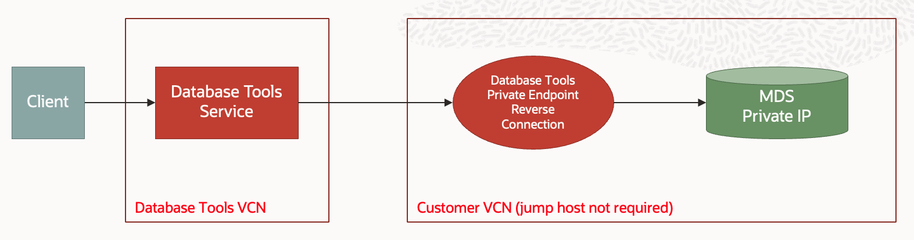

# Database Tools Examples

## Introduction
We show 5 use cases for the Database Tools service

## Use Cases
- ADB-S with public ip
- ADB-S with private endpoint
- Bare Metal, VM and Exadata with private ip
- MySQL with public ip
- MySQL DB System with private endpoint

## ADB-S with Public IP

### Example
See: **adbs_create_connection_public_ip.py** where we:
1. Create a new Autonomous Database (ADB-S)
2. Create required secrets
3. Create a connection
4. Validate the connection

## ADB-S with Private Endpoint

### Example
See: **adbs_create_connection_with_pe.py** where we:
1. Create a Database Tools private endpoint
2. Create required secrets
3. Create a connection using the Database Tools private endpoint
4. Validate the connection

## Bare Metal, DB System and Exadata with Private IP

### Example
See: **db_system_create_connection_private_subnet.py** where we:
1. Create a Database Tools private endpoint
2. Create required secret
3. Create a connection using the Database Tools private endpoint
4. Validate the connection

## MySQL with Public IP

### Example
See: **mysql_create_connection_public_ip.py** where we:
1. Create required secret
2. Create a connection
3. Validate the connection

## MySQL DB System with Private Edpoint

### Example
See: **mysql_db_system_create_connection_with_pe.py** where we:
1. Create a Database Tools private endpoint
2. Create required secret
3. Create a connection using the Database Tools private endpoint
4. Validate the connection
