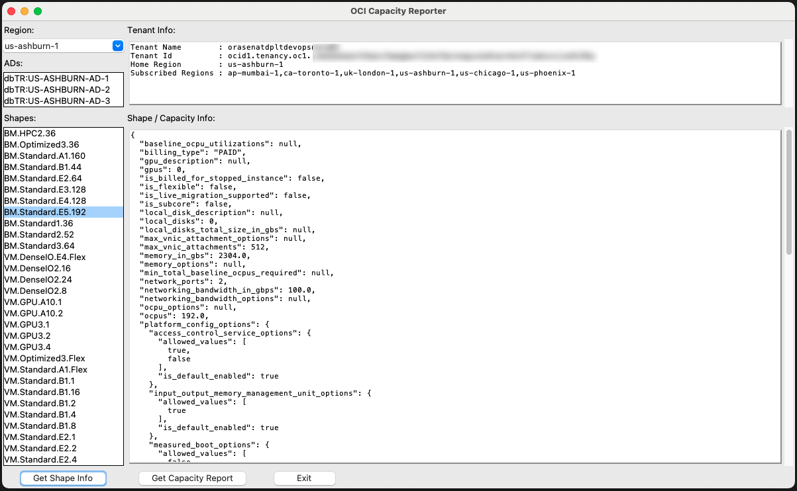

## OCI Capacity Reporter - Oracle Cloud Infrastructure capacity reporter

A simple, tkinter-based UI using the OCI Python SDK that allows the user to inspect available shapes within their OCI tenant and generate available
capacity reports based on the caller's OCI config definition and current limits see [doc](https://docs.oracle.com/en-us/iaas/Content/API/Concepts/sdkconfig.htm) for more information.

**DISCLAIMER - This is not an official Oracle application,  It does not supported by Oracle Support.

**Developed by Derek T. Chambers-Boucher, 2024 Contribution: Adi Zohar**

## Modules Included:
- oci.identity.IdentityClient
- oci.core.ComputeClient

## Executing using your PC (Application use GUI):
```
1. install python3
   
2. install oci sdk package and oci cli for config
   pip3 install --user oci oci-cli

3. setup oci config for authentication
   oci setup config

4. download the app - oci_capacity_reporter_gui.py

5. run oci_capacity_reporter_gui.py
   python3 oci_capacity_reporter_gui.py
```

## Installation of Python 3 incase you don't have Python3 installed:
Please follow [Python Documentation](https://docs.python.org/3/using/index.html)

## Install OCI SDK Packages:
Please follow [Oracle Python SDK Documentation](https://github.com/oracle/oci-python-sdk)


## Setup connectivity using User

```  
1. Login to your OCI Cloud console

2. Create new group : ShowRewardsGroup  

3. Create new Policy: CapacityReporterGroup with Statements:
   Allow group CapacityReporterGroup to inspect tenancies in tenancy
   Allow group CapacityReporterGroup to inspect compartments in tenancy
   Allow group CapacityReporterGroup to inspect instances in tenancy
   Allow group CapacityReporterGroup to manage compute-capacity-reports in tenancy

4. Create new User  : CapacityReport -> Add to CapacityReporterGroup group  

5. Config OCI config file - ~/.oci/config
   Please follow SDK config documentation - https://docs.cloud.oracle.com/en-us/iaas/Content/API/Concepts/sdkconfig.htm 
```

Execute  

```
$ python3 oci_capacity_reporter_gui.py --help  

options:
  -h, --help         show this help message and exit
  -c CONFIG_FILE     OCI CLI Config file
  -t CONFIG_PROFILE  Config Profile inside the config file
  -p PROXY           Set Proxy (i.e. www-proxy-server.com:80)
  -ip                Use Instance Principals for Authentication
  -is                Use Config and Security Token
```

## Check Other Projects

- [ShowOCI](https://github.com/oracle/oci-python-sdk/tree/master/examples/showoci)

- [ShowUsage](https://github.com/oracle/oci-python-sdk/tree/master/examples/showusage)

- [ShowSubscription](https://github.com/oracle/oci-python-sdk/tree/master/examples/showsubscription)

- [ShowRewards](https://github.com/oracle/oci-python-sdk/tree/master/examples/showrewards)

- [List Resources in Tenancy](https://github.com/oracle/oci-python-sdk/tree/master/examples/list_resources_in_tenancy)

- [Object Storage Tools](https://github.com/oracle/oci-python-sdk/tree/master/examples/object_storage)

- [Tag Resources in Tenancy](https://github.com/oracle/oci-python-sdk/tree/master/examples/tag_resources_in_tenancy)

- [Usage2ADW](https://github.com/oracle-samples/usage-reports-to-adw)


## Below example of reports from demo tenancy (random info generated)

```
########################################################################################################################
#                                                OCI Capacity Reporter                                                 #
########################################################################################################################
Author          : Derek T. Chambers-Boucher
Disclaimer      : This is not an official Oracle application,  It does not supported by Oracle, It should NOT be used for utilization calculation purposes !
Machine         : host-mac (arm64)
App Version     : 24.05.21
OCI SDK Version : 2.123.0
Python Version  : 3.10.6
Authentication  : Config File
Date/Time       : 2024-05-21 16:48:20
Command Line    : 

Connecting to Identity Service...

Loaded 6 regions.
Initiating GUI...

Loaded 98 shapes
Set region to 'us-ashburn-1' with 3 ADs
Loaded 46 shapes for AD dbTR:US-ASHBURN-AD-1
Running capacity report for BM.DenseIO.E4.128
Good Bye.

```


