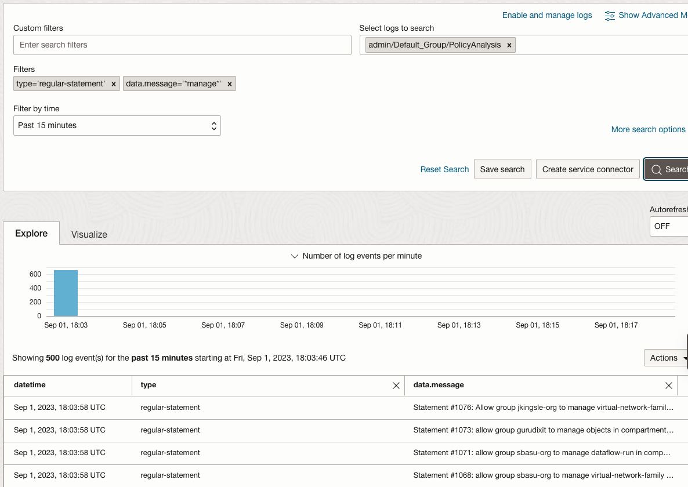

# OCI Policy Analysis

This script recursively builds (and caches) a list of policy statements with provenance
across a tenancy.  Because policies can be located in sub-compartments, it is generally harder
to find which policies apply to a resource, a group, a compartment, and such.
By running this script, you build a list of all statements in the tenancy (if you omit `-o`) or from a starting compartment and below (with `-o`), regardless of where they are located in the hierarchy, and then you use the filtering commands to retrieve what you want. Statements will be split into 4 categories:

* Special (define / endorse / etc)
* Service (allow service xxx)
* Dynamic Group (allow dynamic-group yyy)
* Regular (everything else)

In addition, the script parses the statements into 5-tuples, (subject, verb, resource, location, condition).  These tuples allow for filtering, see the arguments below.  In general filtering is non-case-sesitive match within the term.

In terms of output, the script is able to output the results of the current filtered content as JSON with `-w`.   The script always writes a cache of the statements locally, so that if `-c` is provided, the script starts from there instead of traversing the tenancy.

Additional features:
- To use instance principals, provide `-ip`.  Otherwise, it will use your default profile, or a named profile from your local config with `-pr`
- To limit the depth of the scan, (ie just the root compartment), provide `-m` and an integer.  The default is 6, the maximum depth of the compartment tree.
- To write the results to an OCI log, for example to do so from cron nightly and have a searchable policy history, provide `-lo` and an OCID of a writable log for the user or instance.

Run the command with `-h` for help:
```bash
[opc@instance ~]$ python3 ./oci-policy-analysis.py -h
  -h, --help            show this help message and exit
  -v, --verbose         increase output verbosity
  -pr PROFILE, --profile PROFILE
                        Config Profile, named
  -o OCID, --ocid OCID  OCID of compartment (if not passed, will use tenancy OCID from profile)
  -sf SUBJECTFILTER, --subjectfilter SUBJECTFILTER
                        Filter all statement subjects by this text
  -vf VERBFILTER, --verbfilter VERBFILTER
                        Filter all verbs (inspect,read,use,manage) by this text
  -rf RESOURCEFILTER, --resourcefilter RESOURCEFILTER
                        Filter all resource (eg database or stream-family etc) subjects by this
                        text
  -lf LOCATIONFILTER, --locationfilter LOCATIONFILTER
                        Filter all location (eg compartment name) subjects by this text
  -m MAXLEVEL, --maxlevel MAXLEVEL
                        Max recursion level (0 is root only)
  -c, --usecache        Load from local cache (if it exists)
  -w, --writejson       Write filtered output to JSON
  -ip, --instanceprincipal
                        Use Instance Principal Auth - negates --profile
  -lo LOGOCID, --logocid LOGOCID
                        Use an OCI Log - provide OCID
```
### Filtering Directives
To filter, think of the components of a policy statement as 5 parts (subject, verb, resource, location, condition).  The filters simply do a text match (case-insensitive).  For example, if there are 1000 statements and you add a filter like `-sf mygroup`, the list will be pared down to only those statements.

Filters can be combined.  Meaning that adding 2 or even 3 or 4 filters will get the list down further.  Example, to find all occurrences of `manage` and `tenancy`, and use instance principals, do this:
```bash
python3 ./oci-policy-analysis.py -ip -c -vf manage -lf tenancy
```

### OCI Logging
To write policy statements to OCI Log, provide `-lo <log_ocid>`.  By doing this it will write all policy statements to an OCI Log.  Then use OCI Logging Search to see the output.



## Find Unused Dynamic Groups
Companion to policy script.  Uses the cached policy statements and loads all DGs from the tenancy into memory.  Once loaded, it checks to see if there are any DG policy statements that are applicable.  If not, it adds to a list (no deletes).

This script support both `-i` and `-pr` for instance principals and profile selection

Run this with:
```bash
python3 ./oci-unused-dynamic-groups.py -ip
<lists unused DGs with OCID>
```

