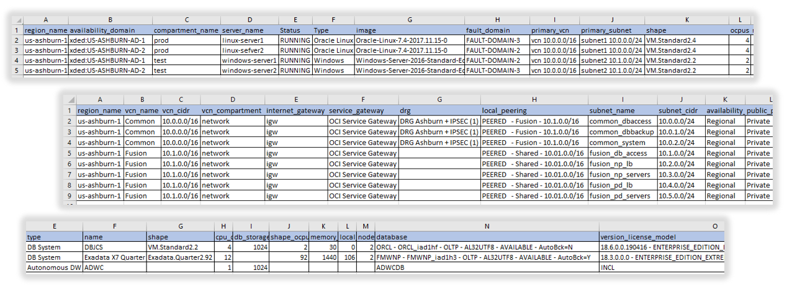
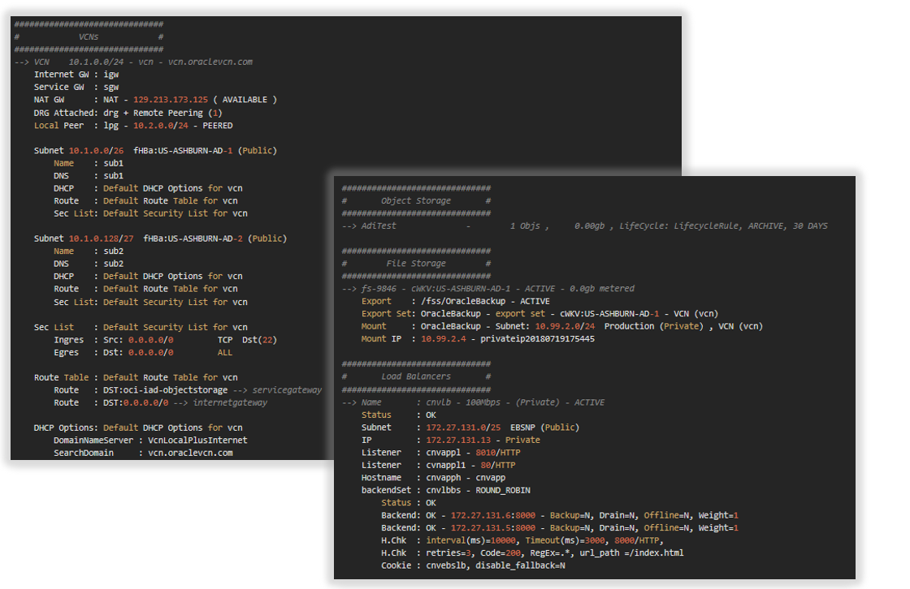
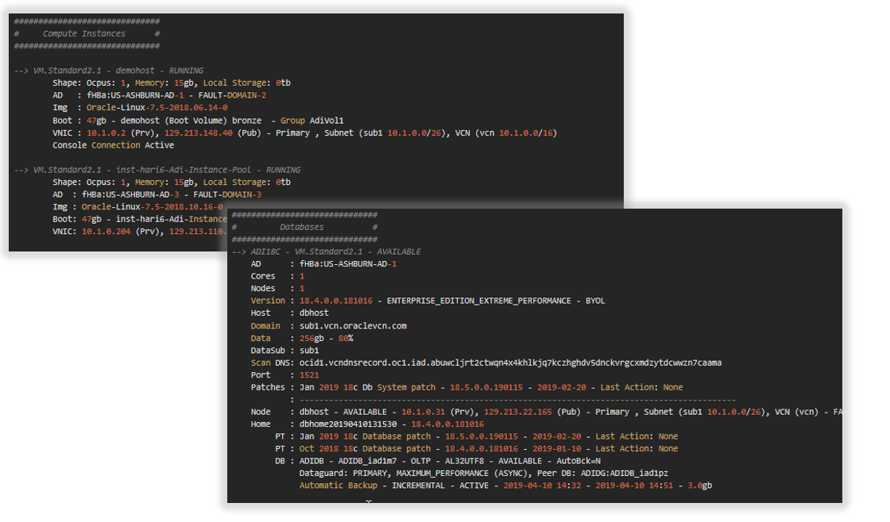
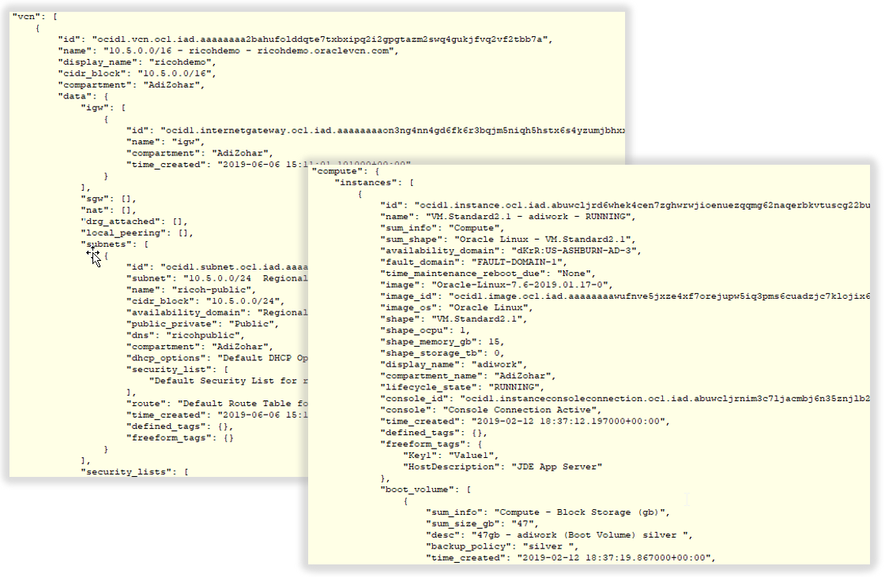
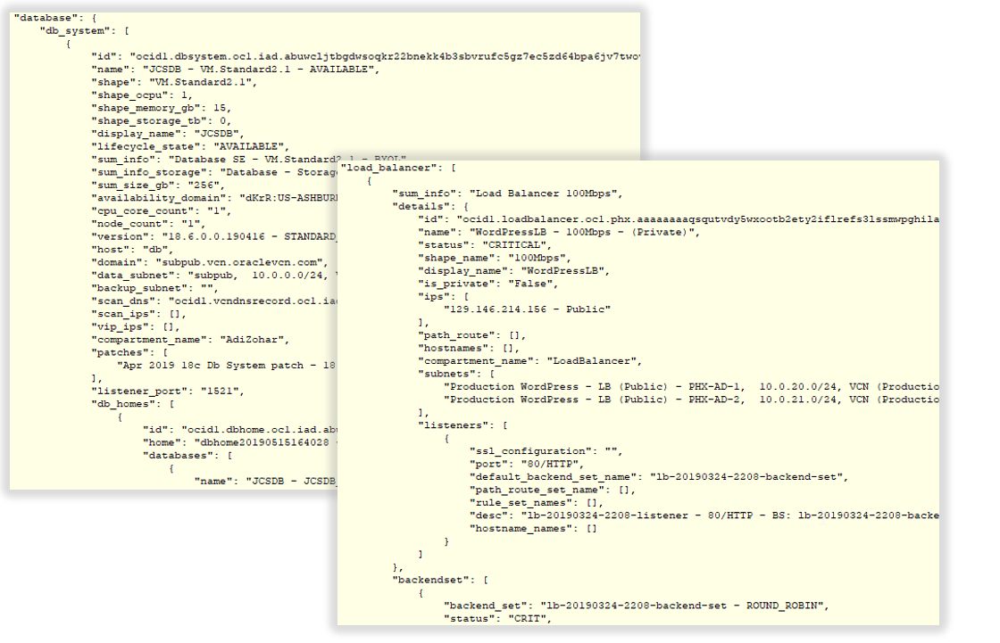

## showoci - Oracle Cloud Infrastructure Reporting Tool

SHOWOCI is a reporting tool which uses the Python SDK to extract list of resources from your tenant. 
It covers most of OCI components, 
Authentication by User or Compute using instance principals, 
Output can be printer friendly, CSV files or JSON file.







## Modules Included:  
- oci.core.VirtualNetworkClient          
- oci.core.ComputeClient                 
- oci.core.ComputeManagementClient       
- oci.core.BlockstorageClient            
- oci.file_storage.FileStorageClient     
- oci.object_storage.ObjectStorageClient 
- oci.database.DatabaseClient            
- oci.identity.IdentityClient            
- oci.load_balancer.LoadBalancerClient   
- oci.email.EmailClient
- oci.container_engine.ContainerEngineClient
- oci.streaming.StreamAdminClient
- oci.budget.BudgetClient
- oci.autoscaling.AutoScalingClient
- oci.monitoring.MonitoringClient
- oci.ons.NotificationControlPlaneClient
- oci.ons.NotificationDataPlaneClient
- oci.healthchecks.HealthChecksClient
- oci.announcements_service.AnnouncementClient
- oci.limits.LimitsClient

** DISCLAIMER – This is not an official Oracle application

## OCI Authentication using Instance Principals 

Create Dynamic Group ShowOCIDynamicGroup:
```
any {ALL {instance.id = 'ocid1.instance.oc1.xxxxxxxxxx'}}
```

Add Policy:
```
allow dynamic-group ShowOCIDynamicGroup to read all-resources in tenancy
```

## OCI Authentication using Read Only User
Required OCI IAM user with read only privileges

```
ALLOW GROUP ReadOnlyUsers to read all-resources IN TENANCY
Allow Group ReadOnlyUsers to use network-security-groups in tenancy /* use required for now to read security group rules */
```

For restrictive privileges:

```
Allow group ReadOnlyUsers to inspect all-objects in tenancy
Allow group ReadOnlyUsers to read instances      in tenancy
Allow group ReadOnlyUsers to read load-balancers in tenancy
Allow group ReadOnlyUsers to read buckets        in tenancy
Allow group ReadOnlyUsers to read nat-gateways   in tenancy
Allow group ReadOnlyUsers to read public-ips     in tenancy
Allow group ReadOnlyUsers to read file-family    in tenancy
Allow group ReadOnlyUsers to read instance-configurations in tenancy
Allow Group ReadOnlyUsers to read network-security-groups in tenancy
Allow Group ReadOnlyUsers to use network-security-groups in tenancy /* use required for now to read security group rules */
    
# Explanation:
    read instances      allows - ListInstances
    read load-balancers allows - ListBackendSets, ListBackends, GetHealthChecker (for status)
    read buckets        allows - GetBucket (for size), GetObjectLifecyclePolicy
    read nat-gateways   allows - ListNatGateways
    read public-ips     allows - ListPublicIps (not used yet)
    read file-family    allows - ListExports, ListSnapshots
    read instance-configurations allows - GetInstanceConfiguration

```

## Installation Guide for Python 3 with OCI SDK  

### Installation on Windows  

```
Download Python 3 from https://www.python.org/ 
setup.exe
pip install oci oci-cli  
```

### Installation on Mac using Brew
```
brew install python3
pip3 install oci oci-cli 
```

### Installation on OCI VM with Oracle Cloud Developer Image
```
Default is python 2.7 , please run as below:
python showoci.py
```

### Installation on OCI VM with Oracle Linux 7  

```
# Login as opc and install python3 locally  
sudo yum -y install gcc libffi-devel openssl-devel python-devel sqlite-devel 

# example on python 3.7.2, list of python versions can be found here - https://www.python.org/ftp/python/
wget https://www.python.org/ftp/python/3.7.2/Python-3.7.2.tgz  
tar zxf Python-3.7.2.tgz  
cd Python-3.7.2
./configure --prefix=$HOME/python --enable-loadable-sqlite-extensions  
make  
make install  
cd $HOME  

# Add python to path  
echo 'export PATH=$HOME/python/bin:$PATH' >> ~/.bash_profile  
echo 'export PYTHONPATH=$HOME/python' >> ~/.bash_profile  
source ~/.bash_profile  

# check
which python3  
python3 --version

# install oci and oci-cli  
pip3 install --upgrade pip  
pip3 install oci oci-cli  
```
## Setup connectivity using Instance Principals

```  
1. Login to your OCI Cloud console
2. Create new Dynamic Group : ShowOCIDynamicGroup  
   Obtain Compute OCID and add rule - any {ALL {instance.id = 'ocid1.instance.oc1.xxxxxxxxxx'}}
3. Create new Policy: ShowOCIDynamicGroupPolicy with Statement - allow dynamic-group ShowOCIDynamicGroup to read all-resources in tenancy
```

## Setup connectivity using Read Only User

```  
1. Login to your OCI Cloud console
2. Create new group : ReadOnlyGroup  
3. Create new Policy: ReadOnlyGroupPolicy with Statement - ALLOW GROUP ReadOnlyGroup to read all-resources IN TENANCY  
4. Create new User  : readonly.user -> Add to ReadOnlyGroup group  

# Config OCI  
# Login as opc

oci setup config  
--> config location - /home/opc/.oci/config  
--> Enter a user OCID - copy from the created user   
--> Enter a tenancy OCID - copy from the oci cloud  
--> Region - choose the main region  
--> Do you want to generate a new RSA key pair? Y  

Copy the /home/opc/.oci/oci_api_key_public.pem and add it to the OCI User under API Key  

# Test it:  
$ oci os ns get  
{  
  "data": "tenant_name_xxx"  
}  
```

## Copy the Software
Download the showoci*.py from this project  

Execute  

```
$ ./showoci.py  

usage: showoci.py [-h] [-a] [-ani] [-an] [-b] [-n] [-i] [-c] [-cn] [-o] [-l]
                  [-d] [-f] [-e] [-m] [-s] [-rm] [-so] [-edge] [-lq] [-mc]
                  [-nr] [-ip] [-t PROFILE] [-p PROXY] [-rg REGION]
                  [-cp COMPART] [-cpath COMPARTPATH] [-cf CONFIG] [-csv CSV]
                  [-jf JOUTFILE] [-js] [-sjf SJOUTFILE] [-cachef SERVICEFILE]
                  [-caches] [--version]
                  
optional arguments:
  -h, --help           show this help message and exit
  -a                   Print All Resources
  -ani                 Print All Resources but identity
  -an                  Print Announcements
  -b                   Print Budgets
  -n                   Print Network
  -i                   Print Identity
  -c                   Print Compute
  -cn                  Print Containers
  -o                   Print Object Storage
  -l                   Print Load Balancer
  -d                   Print Database
  -f                   Print File Storage
  -e                   Print EMail
  -lq                  Print Limits and Quotas
  -m                   Print Monitoring and Notifications
  -s                   Print Streams
  -rm                  Print Resource management
  -so                  Print Summary Only
  -edge                Print Edge Services (Healthcheck)
  -mc                  exclude ManagedCompartmentForPaaS
  -nr                  Not include root compartment
  -ip                  Use Instance Principals for Authentication
  -t PROFILE           Config file section to use (tenancy profile)
  -p PROXY             Set Proxy (i.e. www-proxy-server.com:80)
  -rg REGION           Filter by Region
  -cp COMPART          Filter by Compartment
  -cpath COMPARTPATH   Filter by Compartment using path , example -cpath "Adi Main / Adi Sub"
  -cf CONFIG           Config File
  -csv CSV             Output to CSV files, Input as file header
  -jf JOUTFILE         Output to file (JSON format)
  -js                  Output to screen (JSON format)
  -sjf SJOUTFILE       Output to screen (nice format) and JSON File
  -cachef SERVICEFILE  Output Cache to file (JSON format)
  -caches              Output Cache to screen (JSON format)
  --version            show program's version number and exit

```

## Below example of reports from few tenancies  

```
############################################################
#                  Start Extracting Data                   #
############################################################

############################################################
#                        showoci.py                        #
############################################################
Authentication : Config File
Config File    : ~/.oci/config
Config Profile : adi
Version        : 19.4.2
Date/Time      : 2019-04-03 00:00:04
Comand Line    : -t adi -a
OCI SDK Ver    : 2.2.1

############################################################
#                 Load OCI data to Memory                  #
############################################################
Load Guide - '.' Compartment, '+' VCN, '-' Subnets

Identity...
--> Tenancy                  <--  (1) - 0 sec
--> Compartments             <--  (12) - 0 sec

##############################
#    Region us-ashburn-1     #
##############################
Identity...
--> Availability Domains     <--  (3) - 0 sec

Network...
--> Virtual Cloud Networks   <-- ............ (5) - 1 sec
--> Subnets                  <-- +++++ (54) - 7 sec
--> Service Gateways         <-- ............ (1) - 1 sec
--> NAT Gateways             <-- ............ (0) - 0 sec
--> Dynamic Routing GWs      <-- ............ (3) - 2 sec
--> Dynamic Routing GW Attch <-- ............ (3) - 1 sec
--> Customer Prem Equipments <-- ............ (1) - 1 sec
--> IPSEC tunnels            <-- ............ (0) - 1 sec
--> Remote Peer Conns        <-- ............ (1) - 1 sec
--> Virtual Circuits         <-- ............ (2) - 1 sec
--> Internet Gateways        <-- +++++ (3) - 4 sec
--> Local Peer GWs           <-- +++++ (0) - 5 sec
--> Security Lists           <-- +++++ (61) - 5 sec
--> Network Security Groups  <-- ............ (2) - 1 sec
--> DHCP Options             <-- +++++ (8) - 5 sec
--> Route Tables             <-- +++++ (66) - 6 sec
--> Routed Private IPs       <--  (0) - 0 sec

Compute...
--> Instances                <-- ............ (146) - 21 sec
--> Images                   <-- ............ (33) - 5 sec
--> Boot Volumes Attached    <-- ............ (146) - 5 sec
--> Volumes Attached         <-- ............ (120) - 8 sec
--> Vnics Attached           <-- ............ (146) - 22 sec
--> Instance Configurations  <-- ............ (0) - 1 sec
--> Instance Pools           <-- ............ (0) - 1 sec

Block Storage...
--> Block Volume Groups      <-- ............ (0) - 1 sec
--> Boot Volumes             <-- ............ (157) - 13 sec
--> Boot Volumes Backups     <-- ............ (7) - 1 sec
--> Block Volumes            <-- ............ (164) - 15 sec
--> Block Volumes Backups    <--  (344) - 1 sec

Database...
--> DB Systems               <-- ............ (3) - 17 sec
--> Autonomous Databases     <-- ............ (0) - 4 sec

Load Balancer...
--> Load Balancers           <-- ............ (18) - 5 sec
--> Backend Sets             <-- LLLLLLLLLLLL (26) - 49 sec

Object Storage...
--> Buckets                  <-- ............ (4) - 3 sec

File Storage...
--> File Systems             <-- ............ (5) - 1 sec
--> Exports                  <-- ............ (8) - 0 sec
--> Mount Targets            <-- ............ (7) - 2 sec

Email Notifications...
--> Senders                  <-- ............ (0) - 21 sec
--> Suppressions             <-- ............ (0) - 2 sec

Resource Management...
--> Stacks                   <-- ............ (0) - 2 sec

Limits and Quotas...
--> Limits                   <-- . (82) - 19 sec
--> Quotas                   <-- ... (1) - 4 sec

############################################################
#                  Start Processing Data                   #
############################################################

Extracting Identity
    Tenancy...
    Users...
    Groups...
    Dynamic Groups...
    Policies...
    Providers...

Extracting Region us-ashburn-1
    Compartment gse00015259 (root)...
    Compartment Adi...
    Compartment Adi / Dev...
    Compartment Adi / Dev / DevA...
    Compartment Adi / Dev / DevB...
    Compartment Adi / Prod...
    Compartment NetworkCompartment...


##########################################################################################
#                                        Tenancy                                         #
##########################################################################################
Name        - CUST
OCID        - ocid1.tenancy.oc1..aaaaaaaae5u57gqxs5qas5f33qnge63sdoi7s2ji6bk5slscblmxxxxxxx
Home Region - IAD
Subs Region - us-ashburn-1, us-phoenix-1

##############################
#           Users            #
##############################
--> adi.zohar
    Groups = Administrators 

--> adi_ocicli
    Groups = Administrators 

--> adi_terraform
    Groups = Administrators 

##############################
#           Groups           #
##############################
--> Administrators       : adi.zohar  
--> DBAdmin              : 
--> demousers            : api.user  
--> ObjectAdmins         : pocuser  
--> ReadOnlyUsers        : 


##############################
#       Dynamic Groups       #
##############################
--> AdiDynamicGroup
    Desc      :Description
    Rules     :any {ALL {instance.compartment.id = 'Demo'}}

##############################
#          Policies          #
##############################

Compartment Demo:

--> Demo
    Allow group demousers to manage all-resources in compartment Demo
      Allow service PSM to inspect vcns in compartment Demo
      Allow service PSM to use subnets in compartment Demo
      Allow service PSM to use vnics in compartment Demo
      Allow service PSM to manage security-lists in compartment Demo

Compartment gse00000000 (root):

--> ObjectPolicy:
    Allow group ObjectAdmins to manage buckets in tenancy
    Allow group ObjectAdmins to manage objects in tenancy

--> ReadOnlyPolicy:
    ALLOW GROUP ReadOnlyUsers to read all-resources IN TENANCY

--> Tenant Admin Policy:
    ALLOW GROUP Administrators to manage all-resources IN TENANCY

##############################
#     identity providers     #
##############################
--> OracleIdentityCloudService
    Desc      :Oracle identity cloud service added during account creation
    Type      :IDCS
    Protocol  :SAML2
    Redirect  :https://idcs-7520d863a50f4e9ca469bcxxxxxxxxx.identity.oraclecloud.com/fed/v1/idp/sso
    Metadata  :https://idcs-7520d863a50f4e9ca469bxxxxxxxxxx.identity.oraclecloud.com
    Group Map :DemoUsers <-> demousers
    Group Map :OCI_Administrators <-> Administrators

##############################
#     Cost Tracking Tags     #
##############################
--> Project.Billing
    Desc      :Billing Cost
    Created   :2019-04-03 12:38

##############################
#          Budgets           #
##############################
--> DemoBudget for Compartment: Demo (MONTHLY)
    Costs   : Spent: 0.0, Forcasted: 0.0 , Time Computed: 2019-04-17 17:45
    Created : 2019-04-17 15:57, Total Alert Rules: 0

--> BudgetForAdiCompartment for Compartment: Adi (MONTHLY)
    Costs   : Spent: 0.0, Forcasted: 0.0 , Time Computed: 2019-04-17 17:45
    Created : 2019-04-17 13:29, Total Alert Rules: 2

##########################################################################################
#                                  Region us-ashburn-1                                   #
##########################################################################################

############################################################
#              Compartment gse00015259 (root)              #
############################################################

##############################
#       Object Storage       #
##############################
--> AACBucket            -        2 Objs ,     0.00gb
--> ADIDB_Backup         -        0 Objs ,     0.00gb
--> DBaaSBackup          -      132 Objs ,     1.20gb
--> TestBucket1          -        0 Objs ,     0.00gb , 2 Preauth Requests
--> TestBucket2          -        0 Objs ,     0.00gb

##############################
#           EMails           #
##############################
--> Suppression List:
    suppression@oracle.com - MANUAL
    noreply@oracle.com - MANUAL
    
##############################
#           Quotas           #
##############################
--> quota_compute, (quota_compute), Created: 2019-08-24 00:30
    set compute quota vm-dense-io1-16-count to 10 in tenancy

##############################
#         Limits > 0         #
##############################
--> auto-scaling        config-count                          = 200        Used =             Available =             SCOPE=REGION
--> block-storage       backup-count                          = 4000       Used =             Available = 4000        SCOPE=REGION
--> block-storage       total-storage-gb                      = 30720      Used =             Available =             SCOPE=AD     EWTG:US-ASHBURN-AD-1
--> block-storage       total-storage-gb                      = 30720      Used =             Available =             SCOPE=AD     EWTG:US-ASHBURN-AD-2
--> block-storage       total-storage-gb                      = 30720      Used =             Available =             SCOPE=AD     EWTG:US-ASHBURN-AD-3
--> block-storage       volume-count                          = 10000      Used =             Available = 10000       SCOPE=AD     EWTG:US-ASHBURN-AD-1
--> block-storage       volume-count                          = 10000      Used =             Available = 10000       SCOPE=AD     EWTG:US-ASHBURN-AD-2
--> block-storage       volume-count                          = 10000      Used =             Available = 10000       SCOPE=AD     EWTG:US-ASHBURN-AD-3
--> block-storage       volumes-per-group                     = 32         Used =             Available =             SCOPE=AD     EWTG:US-ASHBURN-AD-1
--> block-storage       volumes-per-group                     = 32         Used =             Available =             SCOPE=AD     EWTG:US-ASHBURN-AD-2
--> block-storage       volumes-per-group                     = 32         Used =             Available =             SCOPE=AD     EWTG:US-ASHBURN-AD-3
--> compartments        compartment-count                     = 50         Used = 3           Available = 47          SCOPE=REGION
--> compute             custom-image-count                    = 25         Used =             Available = 25          SCOPE=REGION
--> compute             vm-standard-b1-1                      = 2          Used =             Available = 2           SCOPE=AD     EWTG:US-ASHBURN-AD-1
--> compute             vm-standard-b1-1                      = 2          Used =             Available = 2           SCOPE=AD     EWTG:US-ASHBURN-AD-2
--> compute             vm-standard1-1-count                  = 2          Used =             Available = 2           SCOPE=AD     EWTG:US-ASHBURN-AD-3
--> compute             vm-standard1-2-count                  = 2          Used =             Available = 2           SCOPE=AD     EWTG:US-ASHBURN-AD-1
--> compute             vm-standard1-2-count                  = 2          Used =             Available = 2           SCOPE=AD     EWTG:US-ASHBURN-AD-2
--> compute             vm-standard1-2-count                  = 2          Used =             Available = 2           SCOPE=AD     EWTG:US-ASHBURN-AD-3
...

############################################################
#                   Compartment Network                    #
############################################################

##############################
#            VCNs            #
##############################
--> VCN    10.1.0.0/24 - vcn - vcn.oraclevcn.com
    Internet GW : igw
    Service GW  : sgw
    NAT GW      : NAT - 129.213.173.125 ( AVAILABLE )
    DRG Attached: drg + Remote Peering (1)
    Local Peer  : lpg - 10.2.0.0/24 - PEERED

    Subnet 10.1.0.0/26  fHBa:US-ASHBURN-AD-1 (Public)
        Name    : sub1
        DNS     : sub1
        DHCP    : Default DHCP Options for vcn
        Route   : Default Route Table for vcn
        Sec List: Default Security List for vcn

    Subnet 10.1.0.128/27  fHBa:US-ASHBURN-AD-2 (Public)
        Name    : sub2
        DNS     : sub2
        DHCP    : Default DHCP Options for vcn
        Route   : Default Route Table for vcn
        Sec List: Default Security List for vcn

    Sec List    : Default Security List for vcn
        Ingres  : Src: 0.0.0.0/0         TCP  Dst(22)
        Egres   : Dst: 0.0.0.0/0         ALL

    Sec Group   : AdiSecurityGRoup2
        Ingress : NSG: AdiSecurityGRoup1 ALL   

    Sec Group   : AdiSecurityGRoup1
        Ingress : Src: 0.0.0.0/0         TCP   Src(ALL) Dst(22) 
        Ingress : Src: all-iad-services-in-oracle-services-network ALL   
        Egress  : Dst: 0.0.0.0/0         ALL   

    Route Table : Default Route Table for vcn
        Route   : DST:oci-iad-objectstorage --> servicegateway
        Route   : DST:0.0.0.0/0 --> internetgateway

    DHCP Options: Default DHCP Options for vcn
        DomainNameServer : VcnLocalPlusInternet
        SearchDomain     : vcn.oraclevcn.com

--> VCN    10.2.0.0/24 - vcnpeer - vcnpeer.oraclevcn.com
    Service GW  : sgw
    Local Peer  : lpgpeer - 10.1.0.0/24 - PEERED

    Subnet 10.2.0.0/26  fHBa:US-ASHBURN-AD-1 (Public)
        Name    : sub1
        DNS     : sub1
        DHCP    : Default DHCP Options for vcnpeer
        Route   : Default Route Table for vcnpeer
        Sec List: Default Security List for vcnpeer

    Sec List    : Default Security List for vcnpeer
        Ingres  : Src: 0.0.0.0/0         TCP  Dst(22)
        Ingres  : Src: 0.0.0.0/0         ICMP 4,3
        Ingres  : Src: 10.2.0.0/24       ICMP 3
        Egres   : Dst: 0.0.0.0/0         ALL

    DHCP Options: Default DHCP Options for vcnpeer
        DomainNameServer : VcnLocalPlusInternet
        SearchDomain     : vcnpeer.oraclevcn.com

##############################
#            DRGs            #
##############################
--> DRG    drg

##############################
#            CPEs            #
##############################
--> CPE    CUST GR CPE1 - 16.17.18.19
--> CPE    CUST GR CPE2 - 12.13.14.15

##############################
#           IPSec            #
##############################
--> IPSEC  : CUST GR VPN1
    DRG    : CUST Cloud DRG
    CPE    : CUST GR CPE1 - 100.200.100.200
    Tunnel : 16.17.18.19 UP
    Tunnel : 12.13.14.15 UP
    Routes : 0.0.0.0/0

##############################
#       Remote Peering       #
##############################
--> RPC    Name  : AdiRemotePeer
           DRG   : drg
           Status: PEERED
		   Peer  : PhxRemotePeer - us-phoenix-1

############################################################
#                    Compartment Oracle                    #
############################################################

##############################
#     Compute Instances      #
##############################

--> VM.Standard2.1 - demohost - RUNNING
        Shape: Ocpus: 1, Memory: 15gb, Local Storage: 0tb
        AD   : fHBa:US-ASHBURN-AD-1 - FAULT-DOMAIN-2
        Img  : Oracle-Linux-7.5-2018.06.14-0
        Boot : 47gb - demohost (Boot Volume) bronze  - Group AdiVol1
        VNIC : 10.1.0.2 (Prv), 129.213.148.40 (Pub) - Primary , Subnet (sub1 10.1.0.0/26), VCN (vcn 10.1.0.0/16)
        Console Connection Active

--> VM.Standard2.1 - inst-hari6-Adi-Instance-Pool - RUNNING
        Shape: Ocpus: 1, Memory: 15gb, Local Storage: 0tb
        AD   : fHBa:US-ASHBURN-AD-3 - FAULT-DOMAIN-3
        Img  : Oracle-Linux-7.5-2018.10.16-0
        Boot : 47gb - inst-hari6-Adi-Instance-Pool (Boot Volume) 
        VNIC : 10.1.0.204 (Prv), 129.213.110.160 (Pub) - Primary , Subnet (sub3 10.1.0.192/27), VCN (vcn 10.1.0.0/16)
             : SecGrp: AdiSecurityGRoup2, AdiSecurityGRoup1
        Console Connection Active

##############################
# Compute Inst Configuration #
##############################

--> AdiInstanceConfig
        Shape : VM.Standard2.1
        Image : Oracle-Linux-7.5-2018.10.16-0

--> InstanceConfig
        Shape : VM.Standard1.1
        Image : Oracle-Linux-7.5-2018.06.14-0


##############################
#   Compute Instance Pool    #
##############################
--> Adi-Instance-Pool - RUNNING - Size: 1
        ADs   : fHBa:US-ASHBURN-AD-3, fHBa:US-ASHBURN-AD-2
        Config: AdiInstanceConfig - VM.Standard2.1

##############################
#    Compute Autoscaling     #
##############################
--> AutoScallingConfig (ENABLED)
    Resource    : instancePool: Adi-Instance-Pool
    Policy      : auto-scaling-policy-20190417-1627 (threshold)
       Capacity : Initial = 1, Min = 1, Max = 2
       Rule     : CHANGE_COUNT_BY -1  when CPU_UTILIZATION LT 20
       Rule     : CHANGE_COUNT_BY 1   when CPU_UTILIZATION GT 80

##############################
#   Compute Custom Images    #
##############################
--> adi_custom_image1 - Oracle Linux - 47gb - Base:  Oracle-Linux-7.4-2018.01.10-0
--> adi_custom_image2 - Oracle Linux - 47gb - Base:  Oracle-Linux-7.4-2018.01.10-0

##############################
#  Block Boot Not Attached   #
##############################
--> 47gb    - BOOTNOTATT (Boot Volume)  - jjZD:US-ASHBURN-AD-3 - 2018-07-09 16:21

##############################
#    Boot Volume Backups     #
##############################
--> demohost (Boot Volume),  47gb , Stored   1gb, AUTO (bronze), INCR, SCHEDU, 2018-08-01 16:27 -> 2019-08-01 23:07
--> demohost (Boot Volume),  47gb , Stored   1gb, AUTO (bronze), INCR, SCHEDU, 2018-09-01 07:50 -> 2019-09-01 14:30
--> demohost (Boot Volume),  47gb , Stored   1gb, AUTO (bronze), INCR, SCHEDU, 2018-10-01 09:02 -> 2019-10-01 15:42

##############################
#    Block Volume Backups    #
##############################
--> Adi_50G (Source TERMINATED),  50gb , Stored   1gb, Adi_Backup_50G, FULL, MANUAL, 2018-10-22 02:52 -> Keep
--> Adi_50G (Source TERMINATED),  50gb , Stored   1gb, AUTO (bronze), INCR, SCHEDU, 2018-11-01 04:40 -> 2019-11-01 11:20
--> Adi_50G (Source TERMINATED),  50gb , Stored   1gb, AUTO (bronze), INCR, SCHEDU, 2018-12-01 05:53 -> 2019-12-01 12:33
--> Adi_50G (Source TERMINATED),  50gb , Stored   1gb, AUTO (bronze), FULL, SCHEDU, 2019-01-01 06:23 -> 2023-12-31 06:23

##############################
#         Databases          #
##############################
--> ADI18C - VM.Standard2.1 - AVAILABLE
    AD      : fHBa:US-ASHBURN-AD-1
    Cores   : 1
    Nodes   : 1
    Version : 18.4.0.0.181016 - ENTERPRISE_EDITION_EXTREME_PERFORMANCE - BYOL
    Host    : dbhost
    Domain  : sub1.vcn.oraclevcn.com
    Data    : 256gb - 80%
    DataSub : sub1
    Scan DNS: ocid1.vcndnsrecord.oc1.iad.abuwcljrt2ctwqn4x4khlkjq7kczhghdv5dnckvrgcxmdzytdcwwzn7caama
    Port    : 1521
    Patches : Jan 2019 18c Db System patch - 18.5.0.0.190115 - 2019-02-20 - Last Action: None
            : ------------------------------------------------------------------------------------------
    Node    : dbhost - AVAILABLE - 10.1.0.31 (Prv), 129.213.22.165 (Pub) - Primary , Subnet (sub1 10.1.0.0/26), VCN (vcn) - FAULT-DOMAIN-2
    Home    : dbhome20190410131530 - 18.4.0.0.181016
         PT : Jan 2019 18c Database patch - 18.5.0.0.190115 - 2019-02-20 - Last Action: None
         PT : Oct 2018 18c Database patch - 18.4.0.0.181016 - 2019-01-10 - Last Action: None
         DB : ADIDB - ADIDB_iad1m7 - OLTP - AL32UTF8 - AVAILABLE - AutoBck=N
              Dataguard: PRIMARY, MAXIMUM_PERFORMANCE (ASYNC), Peer DB: ADIDG:ADIDB_iad1pz
              Automatic Backup - INCREMENTAL - ACTIVE - 2019-04-10 14:32 - 2019-04-10 14:51 - 3.0gb

--> npappdb - BM.DenseIO1.36 - AVAILABLE
    AD      : iQAs:US-ASHBURN-AD-2
    Cores   : 4
    Version : 12.2.0.1.180116 - ENTERPRISE_EDITION_HIGH_PERFORMANCE - LICENSE_INCLUDED
    Host    : npappdb
    Domain  : dbnp.phxvcn.oraclevcn.com
    Data(gb): None - 80%
    DataSub : 172.27.131.128/26  DBNP (Public)
    Port    : 1521
    Node    : npappdb - AVAILABLE - 172.27.131.130 (Priv), 129.146.127.159 (Pub)  - Primary
    Home 1  : 12.1.0.2             - OraDB12102_home3
            : cnvcdb - cnvcdb - cnvcdbDEFAULTPDB - DSS - US7ASCII - AVAILABLE - AutoBck=N
    Home 2  : 12.1.0.2.180116      - npappdb-dbhome01
            : gldcdb - gldcdb_phx2vp - None - OLTP - AL32UTF8 - AVAILABLE - AutoBck=N
    Home 3  : 12.1.0.2             - OraDB12102_home10
            : qualcdb - qualcdb - qualcdbDEFAULTPDB - OLTP - US7ASCII - AVAILABLE - AutoBck=N

--> npdb - Exadata.Half2.184 - AVAILABLE
    AD      : qFAY:US-ASHBURN-AD-1
    Cores   : 184
    Version : 18.0.0.0.0 - ENTERPRISE_EDITION_EXTREME_PERFORMANCE - BRING_YOUR_OWN_LICENSE
    Host    : dbnp-lg255
    Domain  : db.vnp.oraclevcn.com
    Cluster : crs
    Data(gb): None - 80%
    DataSub : 10.90.2.0/26  db (Private)
    BackSub : 10.90.2.64/26  dbback (Private)
    Scan Ips: 10.90.2.10 - dbnp-lg255-scan-0
    Scan Ips: 10.90.2.11 - dbnp-lg255-scan-1
    Scan Ips: 10.90.2.12 - dbnp-lg255-scan-2
    VIP Ids : 10.90.2.6 - dbnp-lg2551-vip
    VIP Ids : 10.90.2.7 - dbnp-lg2552-vip
    VIP Ids : 10.90.2.8 - dbnp-lg2553-vip
    VIP Ids : 10.90.2.9 - dbnp-lg2554-vip
    Port    : 1521
    Node 1  : dbnp-lg2551 - AVAILABLE - 10.90.2.2 (Priv), None (Pub)  - Primary
    Node 2  : dbnp-lg2553 - AVAILABLE - 10.90.2.4 (Priv), None (Pub)  - Primary
    Node 3  : dbnp-lg2554 - AVAILABLE - 10.90.2.5 (Priv), None (Pub)  - Primary
    Node 4  : dbnp-lg2552 - AVAILABLE - 10.90.2.3 (Priv), None (Pub)  - Primary
    Home 1  : 11.2.0.4 - dbhome20180703145724
            : OADEV - OADEV_iad1g9 - None - OLTP - AL32UTF8 - AVAILABLE - AutoBck=N
    Home 2  : 18.0.0.0 - dbhome20180702145427
            : db18 - db18_iad1z4 - None - OLTP - AL32UTF8 - AVAILABLE - AutoBck=N


##############################
#       Object Storage       #
##############################
--> AdiTest              -        1 Objs ,     0.00gb , LifeCycle: LifecycleRule, ARCHIVE, 30 DAYS

##############################
#        File Storage        #
##############################
--> fs-9846 - cWKV:US-ASHBURN-AD-1 - ACTIVE - 0.0gb metered
    Export    : /fss/OracleBackup - ACTIVE
    Export Set: OracleBackup - export set - cWKV:US-ASHBURN-AD-1 - VCN (vcn)
    Mount     : OracleBackup - Subnet: 10.99.2.0/24  Production (Private) , VCN (vcn)
    Mount IP  : 10.99.2.4 - privateip20180719175445

##############################
#       Load Balancers       #
##############################
--> Name       : cnvlb - 100Mbps - (Private) - ACTIVE
    Status     : OK
    Subnet     : 172.27.131.0/25  EBSNP (Public)
    SecGrp     : AdiSecurityGRoup1
	IP         : 172.27.131.13 - Private
    Listener   : cnvappl - 8010/HTTP
    Listener   : cvnappl1 - 80/HTTP
    Hostname   : cnvapph - cnvapp
    backendSet : cnvlbbs - ROUND_ROBIN
        Status : OK
        Backend: OK - 172.27.131.6:8000 - Backup=N, Drain=N, Offline=N, Weight=1
        Backend: OK - 172.27.131.5:8000 - Backup=N, Drain=N, Offline=N, Weight=1
        H.Chk  : interval(ms)=10000, Timeout(ms)=3000, 8000/HTTP, 
        H.Chk  : retries=3, Code=200, RegEx=.*, url_path =/index.html
        Cookie : cnvebslb, disable_fallback=N

--> Name       : PublicLB_DS - 100Mbps - (Public) - ACTIVE
    Status     : CRITICAL
    Subnet     : 10.0.4.0/24  LB_SUBNET1 (Public)
    Subnet     : 10.0.5.0/24  LB_SUBNET2 (Public)
    IP         : 10.20.30.40 - Public
    Listener   : LB_Listener - 80/HTTP
    backendSet : Backend_Webservers - ROUND_ROBIN
        Status : CRITICAL
        Backend: CRITICAL - 10.0.0.2:80 - Backup=N, Drain=N, Offline=N, Weight=1
        Backend: CRITICAL - 10.0.1.2:80 - Backup=N, Drain=N, Offline=N, Weight=1
        H.Chk  : interval(ms)=10000, Timeout(ms)=3000, 80/HTTP,
        H.Chk  : retries=3, Code=200, RegEx=.*, url_path =/

##############################
#           E-Mail           #
##############################
--> Approved Senders:
    adi.test@abc.com - ACTIVE
    adi.zohar@efg.com - ACTIVE
    
##############################
#    Resource Management     #
##############################
--> StackSimpleVCN - Sub Compartment and VCN Creation
    ormjob20190303213446 - DESTROY    - SUCCEEDED  - 2019-03-04 02:39
    ormjob20190303212919 - APPLY      - SUCCEEDED  - 2019-03-04 02:33
    ormjob20190303211757 - PLAN       - SUCCEEDED  - 2019-03-04 02:21

##############################
#         Containers         #
##############################
--> INFA1 - ACTIVE - v1.11.5
    VCN   : 10.0.0.0/16 - oke-vcn-quick-INFA1-20190306173914 - infa1.oraclevcn.com
    Node  : pool1 - Oracle-Linux-7.5 - VM.Standard2.1
            oke-subnet-quick-INFA1-20190306173914-dKrR:US-ASHBURN-AD-2 10.0.11.0/24, VCN (oke-vcn-quick-INFA1-20190306173914)
            oke-subnet-quick-INFA1-20190306173914-dKrR:US-ASHBURN-AD-1 10.0.10.0/24, VCN (oke-vcn-quick-INFA1-20190306173914)
            oke-subnet-quick-INFA1-20190306173914-dKrR:US-ASHBURN-AD-3 10.0.12.0/24, VCN (oke-vcn-quick-INFA1-20190306173914)

--> K8S Cluster - ACTIVE - v1.11.5
    VCN   : 10.0.0.0/16 - oke-vcn-quick-K8S Cluster-20190306130828 - k8scluster.oraclevcn.com
    Node  : pool1 - Oracle-Linux-7.5 - VM.Standard2.1
            oke-subnet-quick-K8S Cluster-20190306130828-dKrR:US-ASHBURN-AD-3 10.0.12.0/24, VCN (oke-vcn-quick-K8S Cluster-20190306130828)
            oke-subnet-quick-K8S Cluster-20190306130828-dKrR:US-ASHBURN-AD-2 10.0.11.0/24, VCN (oke-vcn-quick-K8S Cluster-20190306130828)
            oke-subnet-quick-K8S Cluster-20190306130828-dKrR:US-ASHBURN-AD-1 10.0.10.0/24, VCN (oke-vcn-quick-K8S Cluster-20190306130828)

##############################
#          Streams           #
##############################
--> AdiStream, partitions (1), Created: 2019-04-10 20:42
    URL   : https://api.cell-1.us-ashburn-1.streaming.oci.oraclecloud.com

##############################
#    Monitoring - Alarms     #
##############################
--> host_cpu_over_80 (oci_computeagent), Enabled = True, Severity = CRITICAL
    Query : CpuUtilization[1m]{resourceDisplayName = "demohost"}.mean() > 80
    Topic : adi_topic - adi_topic_desc


##############################
#   Notifications - Topics   #
##############################
--> adi_topic - adi_topic_desc Created: 2018-12-25 12:00
    Sub   : EMAIL: abc@email.net

##############################
#     Edge - Healthcheck     #
##############################
--> public_http_check (HTTPS: HEAD), Path = /, Enabled = False
    Interval : 30 secs
    Targets  : 129.213.148.40
    VPoints  : aws-cdg

--> public_demohost_check (ICMP, Port: 80), Enabled = False
    Interval : 30 secs, Timeout = 30 secs
    Targets  : 129.213.148.40
    VPoints  : aws-cmh, aws-iad

##############################
#       Announcements        #
##############################
--> Container Engine for Kubernetes (CN-4368) - PRODUCTION_EVENT_NOTIFICATION, 2019-03-22 12:00
    Regions  : Multiple Regions
    Services : ['Oracle Cloud Infrastructure Container Engine for Kubernetes']

--> Container Engine for Kubernetes (CN-4368) - PRODUCTION_EVENT_NOTIFICATION, 2019-03-22 12:25
    Regions  : Multiple Regions
    Services : ['Oracle Cloud Infrastructure Container Engine for Kubernetes']

--> Container Engine for Kubernetes (CN-4368) - PRODUCTION_EVENT_NOTIFICATION, 2019-03-22 12:25
    Regions  : Multiple Regions
    Services : ['Oracle Cloud Infrastructure Container Engine for Kubernetes']

--> Developer Services : Container Engine for Kubernetes: Node Pool Security List Update (CN-3934) - ACTION_REQUIRED, 2019-02-05 15:00
    Regions  : All Regions
    Services : ['Developer Services : Container Engine for Kubernetes']

##########################################################################################
#                                 Summary - us-ashburn-1                                 #
##########################################################################################

###########################################################################
#                      Summary - Compartment generic                      #
###########################################################################
Compute - Block Storage (gb)              -       3547
Compute - Oracle Linux - VM.Standard1.1   -          1
Compute - Oracle Linux - VM.Standard2.1   -          7
Compute - Oracle Linux - VM.Standard2.4   -          1
Object Storage - BV Backups (gb)          -       1276
Object Storage - Buckets (gb)             -        216

###########################################################################
#                        Summary - Compartment npdb                       #
###########################################################################
Database - Exadata.Half2.184              -          1
Database - Exadata.Half2.184 - OCPUs      -         44
Object Storage - Buckets (gb)             -       6152

###########################################################################
#                       Summary - Compartment npebs                       #
###########################################################################
Compute - Block Storage (gb)              -      14121
Compute - Oracle Linux - VM.Standard2.1   -         16
Compute - Oracle Linux - VM.Standard2.4   -          6
Compute - Oracle Linux - VM.Standard2.8   -          5
Compute - Windows - VM.Standard2.2        -         28
File Storage (gb)                         -       2617
Load Balancer 100Mbps                     -         10
Object Storage - BV Backups (gb)          -       2806
Object Storage - Images (gb)              -       1862

##########################################################################################
#                                     Summary Total                                      #
##########################################################################################
Compute - Block Storage (gb)              -      17668
Compute - Oracle Linux - VM.Standard1.1   -          1
Compute - Oracle Linux - VM.Standard2.1   -         23
Compute - Oracle Linux - VM.Standard2.4   -          7
Compute - Oracle Linux - VM.Standard2.8   -          5
Compute - Windows - VM.Standard2.2        -         28
Database - Exadata.Half2.184              -          1
Database - Exadata.Half2.184 - OCPUs      -         44
File Storage (gb)                         -       2617
Load Balancer 100Mbps                     -         10
Object Storage - BV Backups (gb)          -       4082
Object Storage - Buckets (gb)             -       6368
Object Storage - Images (gb)              -       1862
```
  
## Below example JSON report on us-ashburn-1 region, compartment Adi without identity 

```
> showoci -t gse00015259 -ani -js -rg us-ashburn-1 -cp Adi

############################################################
#                        showoci.py                        #
############################################################
Config File    : ~/.oci/config
Config Profile : gse00015259
Version        : 19.4.2
Date/Time      : 2019-04-05 08:14:53
Comand Line    : -t gse00015259 -ani -js -rg us-ashburn-1 -cp Adi
OCI SDK Ver    : 2.2.1


############################################################
#                 Load OCI data to Memory                  #
############################################################
Load Guide - '.' Compartment, '+' VCN, '-' Subnets
Filtered by Region      = us-ashburn-1
Filtered by Compartment = Adi

Identity...
--> Tenancy                  <--  (1) - 0 sec
--> Compartments             <--  (1) - 0 sec


##############################
#    Region us-ashburn-1     #
##############################
Identity...
--> Availability Domains     <--  (3) - 0 sec

Network...
--> Virtual Cloud Networks   <-- . (3) - 0 sec
--> Subnets                  <-- +++ (6) - 0 sec
--> Service Gateways         <-- . (2) - 0 sec
--> NAT Gateways             <-- . (1) - 0 sec
--> Dynamic Routing GWs      <-- . (2) - 0 sec
--> Dynamic Routing GW Attch <-- . (2) - 0 sec
--> Customer Prem Equipments <-- . (0) - 0 sec
--> IPSEC tunnels            <-- . (0) - 0 sec
--> Remote Peer Conns        <-- . (1) - 0 sec
--> Virtual Circuits         <-- . (0) - 0 sec
--> Internet Gateways        <-- +++ (3) - 0 sec
--> Local Peer GWs           <-- +++ (2) - 0 sec
--> Security Lists           <-- +++ (3) - 0 sec
--> DHCP Options             <-- +++ (3) - 0 sec
--> Route Tables             <-- +++ (6) - 0 sec
--> Routed Private IPs       <--  (0) - 0 sec

Compute...
--> Instances                <-- . (3) - 2 sec
--> Images                   <-- . (1) - 0 sec
--> Boot Volumes Attached    <-- . (3) - 0 sec
--> Volumes Attached         <-- . (0) - 0 sec
--> Vnics Attached           <-- . (3) - 6 sec
--> Instance Configurations  <-- . (2) - 0 sec
--> Instance Pools           <-- . (1) - 0 sec

Block Storage...
--> Block Volume Groups      <-- . (1) - 0 sec
--> Boot Volumes             <-- . (8) - 1 sec
--> Boot Volumes Backups     <-- . (11) - 0 sec
--> Block Volumes            <-- . (2) - 0 sec
--> Block Volumes Backups    <--  (6) - 0 sec

Database...
--> DB Systems               <-- . (2) - 5 sec
--> Autonomous Databases     <-- . (0) - 1 sec

Load Balancer...
--> Load Balancers           <-- . (1) - 0 sec
--> Backend Sets             <-- L (1) - 0 sec

Object Storage...
--> Buckets                  <-- . (2) - 0 sec

File Storage...
--> File Systems             <-- . (1) - 0 sec
--> Exports                  <-- . (1) - 0 sec
--> Mount Targets            <-- . (1) - 0 sec

Email Notifications...
--> Senders                  <-- . (1) - 2 sec
--> Suppressions             <-- . (0) - 0 sec

Resource Management...
--> Stacks                   <-- . (0) - 0 sec


############################################################
#                  Start Processing Data                   #
############################################################

Processing Region us-ashburn-1

Processing...
    Compartment Adi...

[
    {
        "type": "showoci",
        "data": {
            "program": "showoci.py",
            "author": "Adi Zohar",
            "config_file": "~/.oci/config",
            "config_profile": "gse00015259",
            "version": "19.4.2",
            "datetime": "2019-04-05 08:14:53",
            "cmdline": "-t gse00015259 -ani -js -rg us-ashburn-1 -cp Adi",
            "oci_sdk_version": "2.2.1"
        }
    },
    {
        "type": "region",
        "region": "us-ashburn-1",
        "data": [
            {
                "compartment": "Adi",
                "path": "Adi",
                "network": {
                    "vcn": [
                        {
                        {
                            "id": "ocid1.vcn.oc1.iad.aaaaaaaao2fz5lgsvyph2egdljbcb34p4ifsswl3hsiwbepczkq4rzornzgq",
                            "name": "10.1.0.0/24 - vcn - vcn.oraclevcn.com",
                            "compartment": "Adi",
                            "data": {
                                "igw": [
                                    {
                                        "id": "ocid1.internetgateway.oc1.iad.aaaaaaaapc4gu6wsmna3f6ttsujezjw76ayiuhznjrouy554r2nxe47ahimq",
                                        "name": "igw",
                                        "compartment": "Adi"
                                    }
                                ],
                                "sgw": [
                                    {
                                        "id": "ocid1.servicegateway.oc1.iad.aaaaaaaaybkhf6yqhhvxy4xtubf2ez4av2cyz7lpsjzllwlhozoeooltozva",
                                        "name": "sgw",
                                        "services": "OCI IAD Object Storage",
                                        "compartment": "Adi",
                                        "defined_tags": {},
                                        "freeform_tags": {}
                                    }
                                ],
                                "nat": [
                                    {
                                        "id": "ocid1.natgateway.oc1.iad.aaaaaaaa75umb5y5yldihawp7324xidataspcq4hdv746vpfzf5scygzamwq",
                                        "name": "NAT - 129.213.173.125",
                                        "compartment": "Adi",
                                        "defined_tags": {},
                                        "freeform_tags": {
                                            "ENV": "Dev"
                                        }
                                    }
                                ],
                                "drg_attached": [
                                    {
                                        "id": "ocid1.drgattachment.oc1.iad.aaaaaaaasfb4eaoxvglzhesefpb77spstqn5hn7a42gki2tgofjmqblmcfqa",
                                        "drg_id": "ocid1.drg.oc1.iad.aaaaaaaadnf4ljd7mxb2zsatdcai3xrwuo3kqqrcm6ad7e4iprmkiukkc56q",
                                        "name": "drg + Remote Peering (1) + Transit Route(TransitRoute)",
                                        "compartment": "Adi"
                                    }
                                ],
                                "local_peering": [
                                    {
                                        "id": "ocid1.localpeeringgateway.oc1.iad.aaaaaaaatjy2jbwm6kzmaame44lkitdgemam4ydvr43mdds7pmheur75powa",
                                        "name": "PEERED   - lpg - 10.2.0.0/24 + Transit Route(TransitLPGRoute)",
                                        "compartment": "Adi"
                                    }
                                ],
                                "subnets": [
                                    {
                                        "id": "ocid1.subnet.oc1.iad.aaaaaaaadtzjjq7s3byjaerrscksaqsbjv377rivwdneta5p3qyytbtvjjna",
                                        "subnet": "10.1.0.0/26  fHBa:US-ASHBURN-AD-1 (Public)",
                                        "name": "sub1",
                                        "dns": "sub1",
                                        "compartment": "Adi",
                                        "dhcp_options": "Default DHCP Options for vcn",
                                        "security_list": [
                                            "Default Security List for vcn"
                                        ],
                                        "route": "Default Route Table for vcn",
                                        "defined_tags": {},
                                        "freeform_tags": {}
                                    },
                                    {
                                        "id": "ocid1.subnet.oc1.iad.aaaaaaaawirhmbaj37wnknc3oomapllkqawlfgihh3u47dux56n4mjst7mmq",
                                        "subnet": "10.1.0.128/27  fHBa:US-ASHBURN-AD-2 (Private) ",
                                        "name": "sub2",
                                        "dns": "sub2",
                                        "compartment": "Adi",
                                        "dhcp_options": "Default DHCP Options for vcn",
                                        "security_list": [
                                            "Default Security List for vcn"
                                        ],
                                        "route": "sub2RT",
                                        "defined_tags": {},
                                        "freeform_tags": {}
                                    },
                                    {
                                        "id": "ocid1.subnet.oc1.iad.aaaaaaaa7uaacvuaooovyym734ckungwjhrxcpt4uahqgjotl5llb3c32goq",
                                        "subnet": "10.1.0.192/27  fHBa:US-ASHBURN-AD-3 (Public)",
                                        "name": "sub3",
                                        "dns": "sub3",
                                        "compartment": "Adi",
                                        "dhcp_options": "Default DHCP Options for vcn",
                                        "security_list": [
                                            "Default Security List for vcn"
                                        ],
                                        "route": "Default Route Table for vcn",
                                        "defined_tags": {},
                                        "freeform_tags": {}
                                    }
                                ],
                                "security_lists": [
                                    {
                                        "id": "ocid1.securitylist.oc1.iad.aaaaaaaaoakzxl7uqi3ttwgxtpvi5i5qldquliqvq5zsnkuzws5654xa5gqq",
                                        "name": "Default Security List for vcn",
                                        "compartment": "Adi",
                                        "sec_rules": [
                                            {
                                                "is_stateless": "False",
                                                "protocol": "6",
                                                "protocol_name": "TCP",
                                                "source": "0.0.0.0/0",
                                                "src_port_min": "22",
                                                "src_port_max": "22",
                                                "destination": "",
                                                "dst_port_min": "",
                                                "dst_port_max": "",
                                                "icmp_code": "",
                                                "icmp_type": "",
                                                "desc": "Ingress: Src: 0.0.0.0/0         TCP   Src(ALL) Dst(22) "
                                            },
                                            {
                                                "is_stateless": "False",
                                                "protocol": "1",
                                                "protocol_name": "ICMP",
                                                "source": "0.0.0.0/0",
                                                "src_port_min": "",
                                                "src_port_max": "",
                                                "destination": "",
                                                "dst_port_min": "",
                                                "dst_port_max": "",
                                                "icmp_code": "4",
                                                "icmp_type": "3",
                                                "desc": "Ingress: Src: 0.0.0.0/0         ICMP  4,3"
                                            },
                                            {
                                                "is_stateless": "False",
                                                "protocol": "all",
                                                "protocol_name": "ALL",
                                                "source": "",
                                                "src_port_min": "",
                                                "src_port_max": "",
                                                "destination": "0.0.0.0/0",
                                                "dst_port_min": "",
                                                "dst_port_max": "",
                                                "icmp_code": "",
                                                "icmp_type": "",
                                                "desc": "Egres  : Dst: 0.0.0.0/0         ALL   "
                                            }
                                        ],
                                        "time_created": "2019-02-12 18:21:59.642000+00:00",
                                        "defined_tags": {},
                                        "freeform_tags": {}
                                    },
                                ],
                                "security_groups": [
                                    {
                                        "id": "ocid1.networksecuritygroup.oc1.iad.aaaaaaaawo4zcfvix4ft3xfv7yo3kiif4tlc2v7b2w6y32ay3svnvjwvnwga",
                                        "name": "AdiSecurityGRoup2",
                                        "compartment": "AdiZohar",
                                        "sec_rules": [
                                            {
                                                "id": "834814",
                                                "description": "Access between NSG",
                                                "direction": "INGRESS",
                                                "destination": "",
                                                "destination_name": "",
                                                "destination_type": "",
                                                "source": "ocid1.networksecuritygroup.oc1.iad.aaaaaaaavs2fnryhitdrzysb6lyy6mxmrqjcib7qvckqjufrkf47tgu4bcpa",
                                                "source_name": "AdiSecurityGRoup1",
                                                "source_type": "NETWORK_SECURITY_GROUP",
                                                "is_stateless": "False",
                                                "is_valid": "True",
                                                "protocol": "all",
                                                "protocol_name": "ALL",
                                                "time_created": "2019-07-11 03:31:49.013000+00:00",
                                                "src_port_min": "",
                                                "src_port_max": "",
                                                "dst_port_min": "",
                                                "dst_port_max": "",
                                                "icmp_code": "",
                                                "icmp_type": "",
                                                "desc": "Ingress : NSG: AdiSecurityGRoup1 ALL   "
                                            }
                                        ],
                                        "time_created": "2019-07-11 03:31:48.714000+00:00",
                                        "defined_tags": {},
                                        "freeform_tags": {}
                                    },
                                    {
                                        "id": "ocid1.networksecuritygroup.oc1.iad.aaaaaaaavs2fnryhitdrzysb6lyy6mxmrqjcib7qvckqjufrkf47tgu4bcpa",
                                        "name": "AdiSecurityGRoup1",
                                        "compartment": "AdiZohar",
                                        "sec_rules": [
                                            {
                                                "id": "840091",
                                                "description": "Allow SSH port from Internet to hosts",
                                                "direction": "INGRESS",
                                                "destination": "",
                                                "destination_name": "",
                                                "destination_type": "",
                                                "source": "0.0.0.0/0",
                                                "source_name": "",
                                                "source_type": "CIDR_BLOCK",
                                                "is_stateless": "False",
                                                "is_valid": "True",
                                                "protocol": "6",
                                                "protocol_name": "TCP",
                                                "time_created": "2019-07-11 03:30:24.964000+00:00",
                                                "src_port_min": "22",
                                                "src_port_max": "22",
                                                "dst_port_min": "",
                                                "dst_port_max": "",
                                                "icmp_code": "",
                                                "icmp_type": "",
                                                "desc": "Ingress : Src: 0.0.0.0/0         TCP   Src(ALL) Dst(22) "
                                            }
                                        ],
                                        "time_created": "2019-07-11 03:30:24.621000+00:00",
                                        "defined_tags": {},
                                        "freeform_tags": {
                                            "NSGKey": "PrimaryHosts"
                                        }
                                    }
                                ],
                                "route_tables": [
                                    {
                                        "id": "ocid1.routetable.oc1.iad.aaaaaaaaaxdtkjepzgj2cihuntrbhjuafvmvxxugsvr6cf4aior5g5ic6wlq",
                                        "name": "sub2RT",
                                        "compartment": "Adi",
                                        "route_rules": [
                                            "DST:0.0.0.0/0          --> NATGW",
                                            "DST:oci-iad-objectstor --> SGWsgw"
                                        ]
                                    },
                                    {
                                        "id": "ocid1.routetable.oc1.iad.aaaaaaaa2zmlosrshnuje3tkwqu43poxkeklz2nxp7tfhvvk6d3c7hrjz4ka",
                                        "name": "TransitLPGRoute",
                                        "compartment": "Adi",
                                        "route_rules": [
                                            "DST:0.0.0.0/0          --> DRG - drg"
                                        ]
                                    },
                                    {
                                        "id": "ocid1.routetable.oc1.iad.aaaaaaaap4gb7abeof2crm42zuiwhdxlyvncnetlmrlgwypxzfd323hm6fva",
                                        "name": "TransitRoute",
                                        "compartment": "Adi",
                                        "route_rules": [
                                            "DST:10.0.0.0/8         --> PEERED   - lpg - 10.2.0.0/24"
                                        ]
                                    },
                                    {
                                        "id": "ocid1.routetable.oc1.iad.aaaaaaaalz3hby6vrio3a4qdgafyophdaw4r353sbn2pipawzwgf7kbmklhq",
                                        "name": "Default Route Table for vcn",
                                        "compartment": "Adi",
                                        "route_rules": [
                                            "DST:oci-iad-objectstor --> SGWsgw",
                                            "DST:0.0.0.0/0          --> IGW"
                                        ]
                                    }
                                ],
                                "dhcp_options": [
                                    {
                                        "id": "ocid1.dhcpoptions.oc1.iad.aaaaaaaab52dro2y3yuuvsdbb4qco3v3wcfmvxfhxregft2z5ig5pgcjkgia",
                                        "name": "Default DHCP Options for vcn",
                                        "compartment": "Adi",
                                        "opt": [
                                            "DomainNameServer : VcnLocalPlusInternet",
                                            "SearchDomain     : vcn.oraclevcn.com  "
                                        ]
                                    }
                                ]
                            }
                        }
                    ],
                    "remote_peering": [
                        {
                            "id": "ocid1.remotepeeringconnection.oc1.iad.aaaaaaaavvulhrxdlmlnusfus67ilttz3qbyy4cucmck3o7rswll4x5azkha",
                            "peer_id": "ocid1.remotepeeringconnection.oc1.phx.aaaaaaaa6vbbgmamanroam4rn6hmdfsg6l3565v57fwhbu3qgply7w3ggqea",
                            "name": "AdiRemotePeer",
                            "drg": "DRG - drg",
                            "is_cross_tenancy_peering": "False",
                            "peer_region_name": "us-phoenix-1",
                            "peer_rfc_name": "",
                            "peer_tenancy_id": "ocid1.tenancy.oc1..aaaaaaaae5u57gqxs5qas5f33qnge63sdoi7s2ji6bk5slscblmwr4zvq47q",
                            "peering_status": "PEERED"
                        }
                    ]
                },
                "compute": {
                    "instances": [
                        {
                            "id": "ocid1.instance.oc1.iad.abuwcljrnehdqvc5zfdsifecjly7gm5sbmmt27s4pmjowygs7yginuweo4cq",
                            "name": "VM.Standard1.1 - demohost - RUNNING",
                            "sum_info": "Compute",
                            "sum_shape": "VM.Standard1.1",
                            "availability_domain": "fHBa:US-ASHBURN-AD-1",
                            "fault_domain": "FAULT-DOMAIN-2",
                            "time_maintenance_reboot_due": "None",
                            "image": "Oracle-Linux-7.5-2018.06.14-0",
                            "image_id": "ocid1.image.oc1.iad.aaaaaaaazq7xlunevyn3cf4wppcx2j53eb26pnnc4ukqtfj4tbjjcklnhpaa",
                            "console_id": "ocid1.instanceconsoleconnection.oc1.iad.abuwcljrqsvip6aimwz4sjpn5igc4za5ljn7bvkkrgi56kzefbsugui6hy3a",
                            "console": "Console Connection Active",
                            "defined_tags": {
                                "Project": {
                                    "Prod": "ProdValue",
                                    "Billing": "billing_value"
                                }
                            },
                            "freeform_tags": {
                                "Project": "Basic",
                                "Tag2Key": "12345",
                                "Tag1Key": "Hello"
                            },
                            "boot_volume": [
                                {
                                    "sum_info": "Compute - Block Storage (gb)",
                                    "sum_size_gb": "47",
                                    "desc": "47gb - demohost (Boot Volume) bronze  - Group AdiVol1",
                                    "defined_tags": {},
                                    "freeform_tags": {}
                                }
                            ],
                            "block_volume": [],
                            "vnic": [
                                {
                                    "id": "ocid1.vnic.oc1.iad.abuwcljrxkl6sbhcb7bnvwjwfa6g57r7tnx2kndf3la3w6rvwmcx7h45x3cq",
                                    "desc": "10.1.0.2 (Prv), 129.213.148.40 (Pub) - Primary , Subnet (sub1 10.1.0.0/26), VCN (vcn)"
                                }
                            ]
                        },
                        {
                            "id": "ocid1.instance.oc1.iad.abuwcljs3lrcsidis54oztczwhszmoebigeflbugzifdhzi7fxxgzceklliq",
                            "name": "VM.Standard2.1 - inst-hari6-Adi-Instance-Pool - RUNNING",
                            "sum_info": "Compute",
                            "sum_shape": "VM.Standard2.1",
                            "availability_domain": "fHBa:US-ASHBURN-AD-3",
                            "fault_domain": "FAULT-DOMAIN-3",
                            "time_maintenance_reboot_due": "None",
                            "image": "Oracle-Linux-7.5-2018.10.16-0",
                            "image_id": "ocid1.image.oc1.iad.aaaaaaaageeenzyuxgia726xur4ztaoxbxyjlxogdhreu3ngfj2gji3bayda",
                            "console_id": "",
                            "console": "",
                            "defined_tags": {},
                            "freeform_tags": {
                                "oci:compute:instanceconfiguration": "ocid1.instanceconfiguration.oc1.iad.aaaaaaaasfmvtaywv3kfo6ysr6en4jb3zyojzlqvbsthoew2wxw6fmv7ku6a",
                                "oci:compute:instancepool": "ocid1.instancepool.oc1.iad.aaaaaaaaril5efiy3qyvrtnikkj6spcnh4tuhxpkfvaqod7d4emhxnhr66iq"
                            },
                            "boot_volume": [
                                {
                                    "sum_info": "Compute - Block Storage (gb)",
                                    "sum_size_gb": "47",
                                    "desc": "47gb - inst-hari6-Adi-Instance-Pool (Boot Volume) ",
                                    "defined_tags": {},
                                    "freeform_tags": {}
                                }
                            ],
                            "block_volume": [],
                            "vnic": [
                                {
                                    "id": "ocid1.vnic.oc1.iad.abuwcljsnflxogipkhh3zxw4anlc5wz5nwdgo37yeialami5d42dtc4sfdta",
                                    "desc": "10.1.0.204 (Prv), 129.213.110.160 (Pub) - Primary , Subnet (sub3 10.1.0.192/27), VCN (vcn)"
                                }
                            ]
                        }
                    ],
                    "images": [
                        {
                            "id": "ocid1.image.oc1.iad.aaaaaaaabpmf3pirefc3fnjg4zkai2jr2kuhwacvp4ezz5bgjtfs2epoabxq",
                            "desc": "AdiZoharImage - Oracle Linux - 47gb - Base:  Oracle-Linux-7.5-2018.06.14-0",
                            "sum_info": "Object Storage - Images (gb)",
                            "sum_size_gb": "47",
                            "defined_tags": {},
                            "freeform_tags": {}
                        }
                    ],
                    "instance_configuration": [
                        {
                            "id": "ocid1.instanceconfiguration.oc1.iad.aaaaaaaasfmvtaywv3kfo6ysr6en4jb3zyojzlqvbsthoew2wxw6fmv7ku6a",
                            "name": "AdiInstanceConfig",
                            "shape": "VM.Standard2.1",
                            "source": "Image: Oracle-Linux-7.5-2018.10.16-0"
                        },
                        {
                            "id": "ocid1.instanceconfiguration.oc1.iad.aaaaaaaav4viydth43w76yn4ez53hkl6nn3tstrnqd3f6xua6kzlxsqayira",
                            "name": "InstanceConfig",
                            "shape": "VM.Standard1.1",
                            "source": "Image: Oracle-Linux-7.5-2018.06.14-0"
                        }
                    ],
                    "instance_pool": [
                        {
                            "id": "ocid1.instancepool.oc1.iad.aaaaaaaaril5efiy3qyvrtnikkj6spcnh4tuhxpkfvaqod7d4emhxnhr66iq",
                            "availability_domains": "fHBa:US-ASHBURN-AD-3, fHBa:US-ASHBURN-AD-2",
                            "name": "Adi-Instance-Pool - RUNNING - Size: 1",
                            "instance_configuration_id": "ocid1.instanceconfiguration.oc1.iad.aaaaaaaasfmvtaywv3kfo6ysr6en4jb3zyojzlqvbsthoew2wxw6fmv7ku6a",
                            "instance_configuration_name": "AdiInstanceConfig - VM.Standard2.1"
                        }
                    ],
                    "volume_groups": [
                        {
                            "id": "ocid1.volumegroup.oc1.iad.abuwcljryt4rgn2swkngoeegwmja4flv7xbzh5seczoihjpf5srkhrbrersa",
                            "name": "AdiVol1",
                            "size_in_gbs": "97",
                            "compartment_name": "Adi",
                            "volumes": [
                                "test_vol - 50gb",
                                "demohost (Boot Volume) - 47gb"
                            ],
                            "defined_tags": {},
                            "freeform_tags": {}
                        }
                    ],
                    "boot_not_attached": [
                        {
                            "sum_info": "Compute - Block Storage (gb)",
                            "sum_size_gb": "47",
                            "desc": "47gb    - Clone1                    - fHBa:US-ASHBURN-AD-1 - 2018-10-22 02:50"
                        },
                        {
                            "sum_info": "Compute - Block Storage (gb)",
                            "sum_size_gb": "47",
                            "desc": "47gb    - demolkq (Boot Volume)     - fHBa:US-ASHBURN-AD-1 - 2019-03-18 17:02"
                        },
                        {
                            "sum_info": "Compute - Block Storage (gb)",
                            "sum_size_gb": "47",
                            "desc": "47gb    - LKQ_CLONE                 - fHBa:US-ASHBURN-AD-1 - 2019-03-18 17:08"
                        },
                        {
                            "sum_info": "Compute - Block Storage (gb)",
                            "sum_size_gb": "47",
                            "desc": "47gb    - temp1 (Boot Volume)       - fHBa:US-ASHBURN-AD-2 - 2019-02-20 15:11"
                        },
                        {
                            "sum_info": "Compute - Block Storage (gb)",
                            "sum_size_gb": "50",
                            "desc": "50gb    - Clone_50G                 - fHBa:US-ASHBURN-AD-3 - 2018-10-22 02:58"
                        }
                    ],
                    "volume_not_attached": [
                        {
                            "sum_info": "Compute - Block Storage (gb)",
                            "sum_size_gb": "50",
                            "desc": "50gb    - test_vol            - fHBa:US-ASHBURN-AD-1 - 2019-03-23 02:39 - Group AdiVol1"
                        },
                        {
                            "sum_info": "Compute - Block Storage (gb)",
                            "sum_size_gb": "50",
                            "desc": "50gb    - Adi_50G             - fHBa:US-ASHBURN-AD-3 - 2018-10-22 02:49"
                        }
                    ],
                    "boot_volume_backup": [
                        {
                            "name": "demohost (Boot Volume), ",
                            "desc": "Auto-backup for 2018-08-01 04:00:00 via policy: bronze",
                            "type": "INCREMENTAL, SCHEDULED, 2018-08-01 16:27 -> 2019-08-01 23:07",
                            "size": "47gb , Stored 1gb",
                            "sum_info": "Object Storage - BV Backups (gb)",
                            "sum_size_gb": "1",
                            "boot_volume_id": "ocid1.bootvolume.oc1.iad.abuwcljro5qzmdkv5ybu3ztsziceircahpo5jgpkl3hbk5axvdajc6lccb3q"
                        },
                        {
                            "name": "demohost (Boot Volume), ",
                            "desc": "Auto-backup for 2018-09-01 04:00:00 via policy: bronze",
                            "type": "INCREMENTAL, SCHEDULED, 2018-09-01 07:50 -> 2019-09-01 14:30",
                            "size": "47gb , Stored 1gb",
                            "sum_info": "Object Storage - BV Backups (gb)",
                            "sum_size_gb": "1",
                            "boot_volume_id": "ocid1.bootvolume.oc1.iad.abuwcljro5qzmdkv5ybu3ztsziceircahpo5jgpkl3hbk5axvdajc6lccb3q"
                        },
                        {
                            "name": "demohost (Boot Volume), ",
                            "desc": "Auto-backup for 2018-10-01 04:00:00 via policy: bronze",
                            "type": "INCREMENTAL, SCHEDULED, 2018-10-01 09:02 -> 2019-10-01 15:42",
                            "size": "47gb , Stored 1gb",
                            "sum_info": "Object Storage - BV Backups (gb)",
                            "sum_size_gb": "1",
                            "boot_volume_id": "ocid1.bootvolume.oc1.iad.abuwcljro5qzmdkv5ybu3ztsziceircahpo5jgpkl3hbk5axvdajc6lccb3q"
                        },
                        {
                            "name": "demohost (Boot Volume), ",
                            "desc": "Auto-backup for 2018-11-01 04:00:00 via policy: bronze",
                            "type": "INCREMENTAL, SCHEDULED, 2018-11-01 09:07 -> 2019-11-01 15:47",
                            "size": "47gb , Stored 10gb",
                            "sum_info": "Object Storage - BV Backups (gb)",
                            "sum_size_gb": "10",
                            "boot_volume_id": "ocid1.bootvolume.oc1.iad.abuwcljro5qzmdkv5ybu3ztsziceircahpo5jgpkl3hbk5axvdajc6lccb3q"
                        },
                    ],
                    "volume_backup": [
                        {
                            "name": "Adi_50G ( Source TERMINATED )",
                            "desc": "Adi_Backup_50G",
                            "type": "FULL, MANUAL, 2018-10-22 02:52 -> Keep",
                            "size": "50gb , Stored 1gb",
                            "sum_info": "Object Storage - BV Backups (gb)",
                            "sum_size_gb": "1",
                            "volume_id": "ocid1.volume.oc1.iad.abuwcljsu2ryf2ddayczbsdyd2w4kpt2nxgtnvb6th625td3x72qn5cmmy2a"
                        },
                        {
                            "name": "Adi_50G ( Source TERMINATED )",
                            "desc": "Auto-backup for 2018-11-01 04:00:00 via policy: bronze",
                            "type": "INCREMENTAL, SCHEDULED, 2018-11-01 04:40 -> 2019-11-01 11:20",
                            "size": "50gb , Stored 1gb",
                            "sum_info": "Object Storage - BV Backups (gb)",
                            "sum_size_gb": "1",
                            "volume_id": "ocid1.volume.oc1.iad.abuwcljsu2ryf2ddayczbsdyd2w4kpt2nxgtnvb6th625td3x72qn5cmmy2a"
                        }
                    ]
                },
                "database": {
                    "db_system": [
                        {
                            "id": "ocid1.dbsystem.oc1.iad.abuwcljsgudxgprvd2anozhpkdnfcll6suhjmrfus5o6nkxoanckfyzavaga",
                            "name": "ADIDB02 - VM.Standard1.1 - AVAILABLE",
                            "sum_info": "Database - VM.Standard1.1 - BYOL",
                            "sum_info_storage": "Database - Storage (gb)",
                            "sum_size_gb": "256",
                            "availability_domain": "fHBa:US-ASHBURN-AD-3",
                            "cpu_core_count": "1",
                            "node_count": "1",
                            "version": "18.3.0.0.180717 - ENTERPRISE_EDITION_EXTREME_PERFORMANCE - BYOL",
                            "host": "dbhost",
                            "domain": "sub3.vcn.oraclevcn.com",
                            "data_subnet": "sub3",
                            "backup_subnet": "",
                            "scan_dns": "ocid1.vcndnsrecord.oc1.iad.abuwcljszsvrzlpytvykn4oqoskub6qqebk4wkpkesfa7gdgvf2nomqyrclq",
                            "scan_ips": [],
                            "vip_ips": [],
                            "patches": [
                                "Jan 2019 18c Db System patch - 18.5.0.0.190115 - 2019-02-20 - Last Action: PRECHECK"
                            ],
                            "listener_port": "1521",
                            "db_homes": [
                                {
                                    "id": "ocid1.dbhome.oc1.iad.abuwcljsxzdxx7sigwnrbaewekdpsrcfcd3mrwcvput6zyialrdrpm5r6xla",
                                    "home": "dbhome20181026162225 - 18.3.0.0.180717",
                                    "databases": [
                                        {
                                            "name": "ADIDB02 - ADIDB02_iad3n9 -  - OLTP - AL32UTF8 - AVAILABLE - AutoBck=N",
                                            "backups": [
                                                {
                                                    "name": "Automatic Backup - INCREMENTAL - FAILED",
                                                    "time": "2019-04-05 05:25 - 2019-04-05 05:27",
                                                    "size": "None",
                                                    "sum_info": "Object Storage - DB Backup (gb)",
                                                    "sum_size_gb": ""
                                                },
                                                {
                                                    "name": "Automatic Backup - INCREMENTAL - ACTIVE",
                                                    "time": "2019-01-15 05:25 - 2019-01-15 05:40",
                                                    "size": "6.0gb",
                                                    "sum_info": "Object Storage - DB Backup (gb)",
                                                    "sum_size_gb": "6.0"
                                                }
                                            ],
                                            "defined_tags": {},
                                            "freeform_tags": {}
                                        }
                                    ],
                                    "patches": [
                                        "Jan 2019 18c Database patch - 18.5.0.0.190115 - 2019-02-20 - Last Action: None",
                                        "Oct 2018 18c Database patch - 18.4.0.0.181016 - 2019-01-10 - Last Action: PRECHECK",
                                        "Jul 2018 18c Database patch - 18.3.0.0.180717 - 2018-07-30 - Last Action: APPLY"
                                    ]
                                }
                            ],
                            "db_nodes": [
                                "Node    : dbhost - AVAILABLE - 10.1.0.196 (Prv), 129.213.32.183 (Pub) - Primary , Subnet (sub3 10.1.0.192/27), VCN (vcn) - FAULT-DOMAIN-3"
                            ],
                            "cluster_name": "",
                            "defined_tags": {},
                            "freeform_tags": {},
                            "data": "256gb - 80%"
                        }
                    ]
                },
                "file_storage": [
                    {
                        "id": "ocid1.filesystem.oc1.iad.aaaaaaaaaaaaiovnnfqwillqojxwiotjmfsc2ylefuyqaaaa",
                        "filesystem": "FileSystem-20190203-2217 - fHBa:US-ASHBURN-AD-1 - 0.0gb metered",
                        "sum_info": "File Storage (gb)",
                        "sum_size_gb": "0.0",
                        "snapshots": [],
                        "exports": [
                            {
                                "id": "ocid1.export.oc1.iad.aaaaacvippxhavcjnfqwillqojxwiotjmfsc2ylefuyqaaaa",
                                "file_system_id": "ocid1.filesystem.oc1.iad.aaaaaaaaaaaaiovnnfqwillqojxwiotjmfsc2ylefuyqaaaa",
                                "time_created": "2019-02-03 22:18:03.034000+00:00",
                                "path": "/FileSystem-20190203-2217",
                                "exportset": "MountTarget-20190203-2217 - export set, fHBa:US-ASHBURN-AD-1, Limits: Size (Unlimited), Files (64bit)",
                                "mount_target": [
                                    {
                                        "id": "ocid1.mounttarget.oc1.iad.aaaaacvippxhavjxnfqwillqojxwiotjmfsc2ylefuyqaaaa",
                                        "mount": "MountTarget-20190203-2217, Subnet: sub1,  10.1.0.0/26, VCN (vcn)",
                                        "private_ip_ids": [
                                            "10.1.0.25 - privateip20190203221806"
                                        ]
                                    }
                                ]
                            }
                        ]
                    }
                ],
                "object_storage": [
                    {
                        "name": "AdiTest",
                        "objects": "        1",
                        "size": "      0.0",
                        "sum_size_gb": "0.0",
                        "sum_info": "Object Storage - Buckets (gb)",
                        "preauthenticated_requests": "",
                        "object_lifecycle": " , LifeCycle: LifecycleRule, ARCHIVE, 30 DAYS",
                        "desc": "AdiTest                  -         1 Objs ,       0.0gb (Approx) , LifeCycle: LifecycleRule, ARCHIVE, 30 DAYS"
                    }
                ],
                "load_balancer": [
                    {
                        "sum_info": "Load Balancer 100Mbps",
                        "details": {
                            "id": "ocid1.loadbalancer.oc1.iad.aaaaaaaas25ybf66cnqmis5lxfdi72ey7jl7c4ifski3a5n7ewpdd2jy5dzq",
                            "name": "adi_test_lb - 100Mbps - (Private)",
                            "status": "OK",
                            "ips": [
                                "10.1.0.17 - Private"
                            ],
                            "path_route": [],
                            "hostnames": [],
                            "subnets": [
                                "sub1,  10.1.0.0/26, VCN (vcn)"
                            ],
                            "listeners": []
                        },
                        "backendset": [
                            {
                                "backend_set": "adi_bs - ROUND_ROBIN",
                                "status": "OK  ",
                                "session_persistence": "",
                                "ssl_cert": "",
                                "backends": [
                                    "OK   - 10.1.0.2:22 - Backup=N, Drain=N, Offline=N, Weight=1"
                                ],
                                "health_check": [
                                    "interval(ms)=30000, Timeout(ms)=3000, retries=3",
                                    "22/TCP"
                                ]
                            }
                        ]
                    }
                ]
            }
        ]
    }
]

##########################################################################################
#                     Completed Successfully at 2019-04-05 08:15:16                      #
##########################################################################################

```
