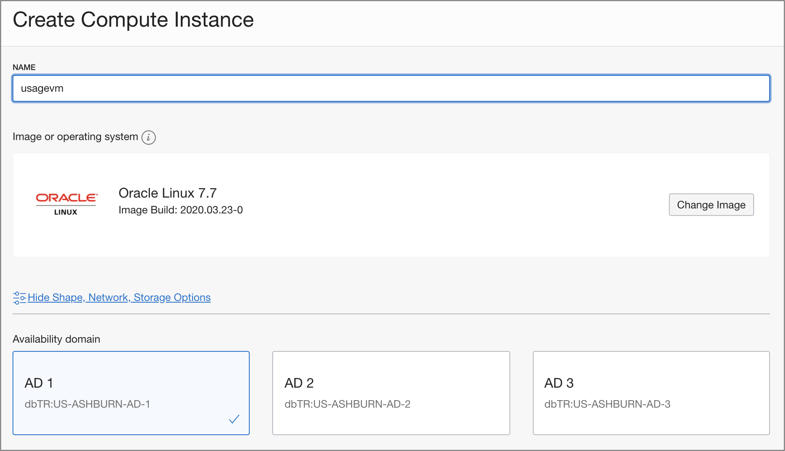
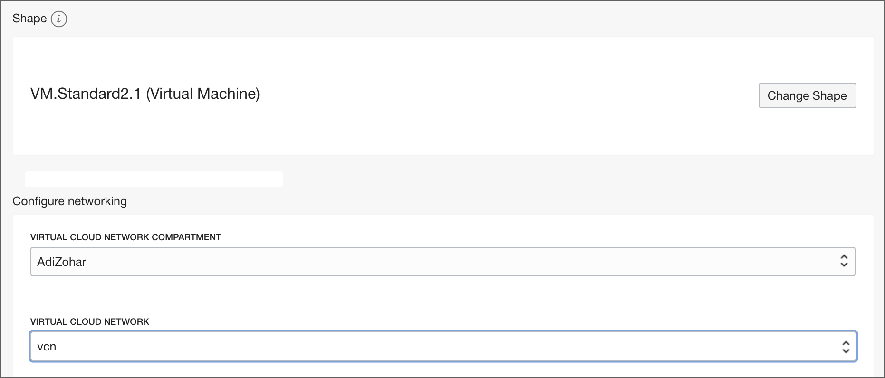
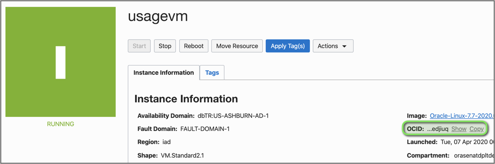
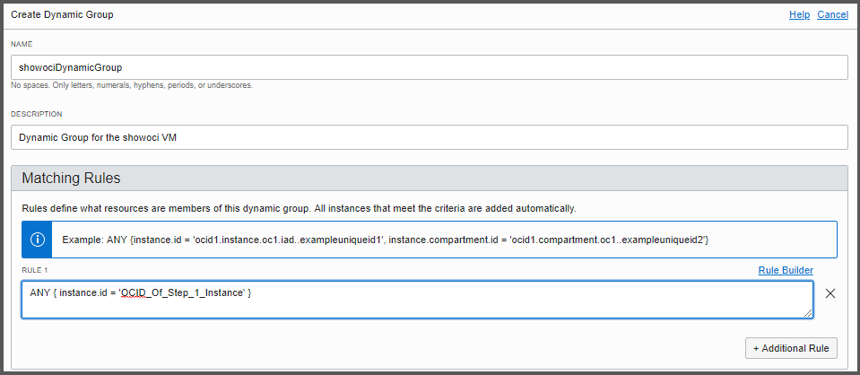
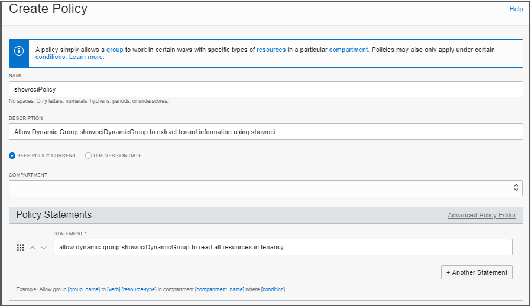

# showoci - Oracle Cloud Infrastructure Reporting Tool

## Step by Step installation Guide on OCI VM
SHOWOCI is a reporting tool which uses the Python SDK to extract list of resources from your tenant. 
It covers most of OCI components, 
Authentication by User or Compute using instance principals, 
Output can be printer friendly, CSV files or JSON file.

**Developed by Adi Zohar**

** DISCLAIMER – This is not an official Oracle application **

## 1. Deploy VM Compute instance to run the python script
```
   OCI -> Menu -> Compute -> Instances
   Create Instance
   --> Name = ShowOCIVM
   --> Image = Oracle Linux 7
   --> Shape = VM.Standard2.1 (Free Micro can be used as well)
   --> Choose your network VCN and Subnet (any type of VCN and Subnet)
   --> Assign public IP -  Optional if on public subnet
   --> Add your public SSH key
   --> Press Create
```






```
   Copy Instance Info:
   --> Compute OCID to be used for Dynamic Group Permission
   --> Compute IP
```

## 2. Create Dynamic Group for Instance Principles

```
   OCI -> Menu -> Identity -> Dynamic Groups -> Create Dynamic Group
   --> Name = ShowOCIDynamicGroup 
   --> Desc = Dynamic Group for the showoci VM
   --> Rule 1 = ANY { instance.id = 'OCID_Of_Step_1_Instance' }
```


## 3. Create Policy to allow the Dynamic Group to run showoci report

```
   OCI -> Menu -> Identity -> Policies
   Choose Root Compartment
   Create Policy
   --> Name = showociPolicy
   --> Desc = Allow Dynamic Group ShowOCIDynamicGroup to extract tenant information using showoci
   --> Statement = allow dynamic-group ShowOCIDynamicGroup to read all-resources in tenancy
   
```



## 4. Login to Linux Machine

```
   Using the SSH key you provided, SSH to the linux machine from step #1
   ssh opc@UsageVM
```

## 5. Install Python 3, GIT and OCI packages

```
   sudo yum install -y python3 git
   sudo pip3 install --upgrade oci oci-cli 

   # test instance principle is working using oci-cli
   oci os ns get --auth instance_principal
   
   [opc@ShowOCIVM ~]$ oci os ns get --auth instance_principal
   {
       "data": "orasenatdplxxxx"
   }
```

## 6. Clone the OCI SDK Repo from Git Hub

```
   git clone https://github.com/oracle/oci-python-sdk
```

## 7. Execute the python script - showoci.py

```
    cd oci-python-sdk/examples/showoci
    python3 showoci.py -ip -ani
```

## License

Copyright (c) 2016, 2020, Oracle and/or its affiliates.  All rights reserved.
This software is dual-licensed to you under the Universal Permissive License (UPL) 1.0 as shown at https://oss.oracle.com/licenses/upl
or Apache License 2.0 as shown at http://www.apache.org/licenses/LICENSE-2.0. You may choose either license.
