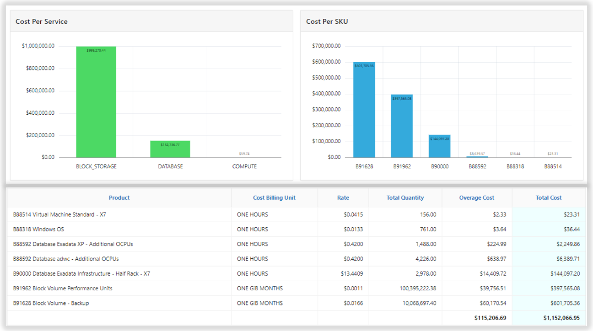
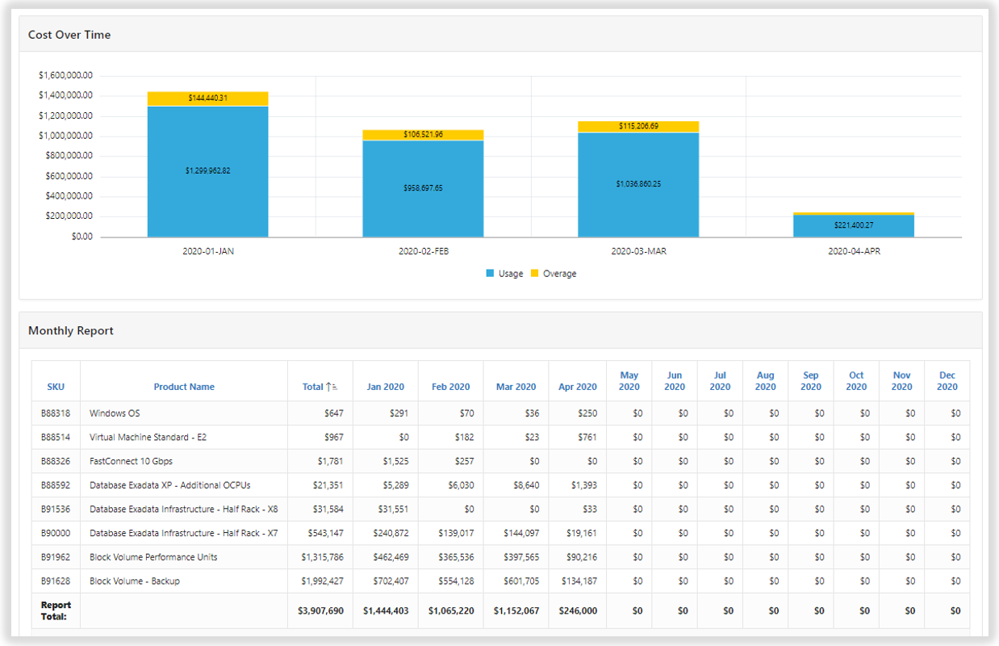
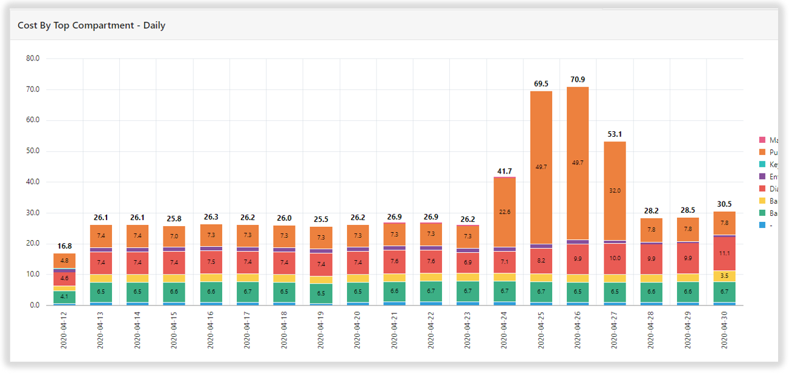
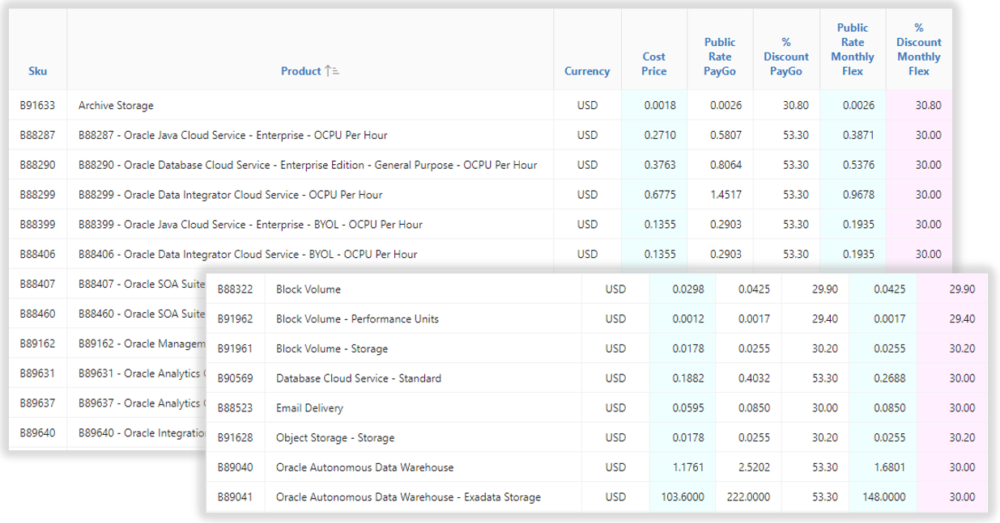
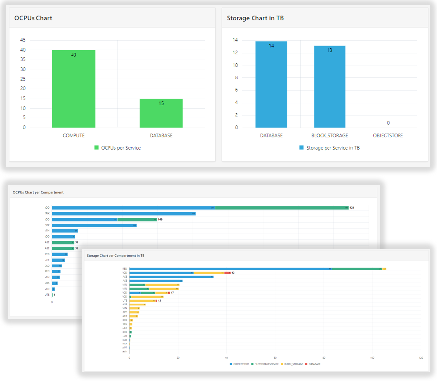
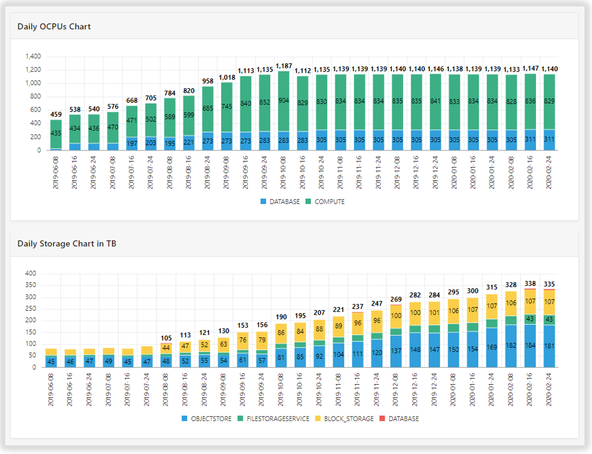
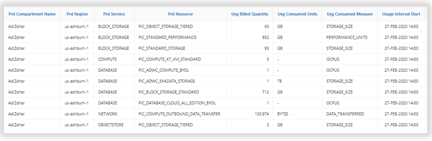

# Usage2ADW - Oracle Cloud Infrastructure Usage and Cost Reports to Autonomous Database Tool

## Introduction
usage2adw is a tool which uses the Python SDK to extract the usage and cost reports from your tenant and load it to Oracle Autonomous Database. (DbaaS can be used as well)
Authentication to OCI by User or instance principals.

It uses APEX for Visualization and generates Daily e-mail report.

**Developed by Adi Zohar, Feb 2020**

** DISCLAIMER – This is not an official Oracle application **

## Main Features
- Usage Current State
- Usage Over Time
- Cost Analysis
- Cost Over Time
- Rate Card for Used Products

## Cost Reports





## Rate Card


## Usage Reports




## Daily E-Mail Report


## Usage Reports Overview
A usage report is a comma-separated value (CSV) file that can be used to get a detailed breakdown of resources in Oracle Cloud Infrastructure for audit or invoice reconciliation.

## How Usage Reports Work
The usage report is automatically generated daily, and is stored in an Oracle-owned Object Storage bucket. It contains one row per each Oracle Cloud Infrastructure resource (such as instance, Object Storage bucket, VNIC) per hour along with consumption information, metadata, and tags. Usage reports generally contain 24 hours of usage data, although occasionally a usage report may contain late-arriving data that is older than 24 hours.

Usage reports are retained for one year.

The file name for each usage report is appended with an automatically incrementing numerical value.

More information can be found at https://docs.cloud.oracle.com/en-us/iaas/Content/Billing/Concepts/usagereportsoverview.htm

## Step by Step Installation Using Oracle cloud Marketplace
Please check step by step guide - [step_by_step_inst_by_marketplace.md](step_by_step_inst_by_marketplace.md)

## Step by Step Installation Guide
Please check step by step guide - [step_by_step_installation.md](step_by_step_installation.md)

## Step by Step Daily Report
Please check step by step daily report guide - [step_by_step_daily_report.md](step_by_step_daily_report.md)


## OCI SDK Modules Included:
- oci.identity.IdentityClient            
- oci.object_storage.ObjectStorageClient 

## Database Tables:
- OCI_USAGE - Raw data of the usage reports
- OCI_USAGE_STATS - Summary Stats of the Usage Report for quick query if only filtered by tenant and date
- OCI_USAGE_TAG_KEYS - Tag keys of the usage reports
- OCI_COST - Raw data of the cost reports
- OCI_COST_STATS - Summary Stats of the Cost Report for quick query if only filtered by tenant and date
- OCI_COST_TAG_KEYS - Tag keys of the cost reports
- OCI_COST_REFERENCE - Reference table of the cost filter keys - SERVICE, REGION, COMPARTMENT, PRODUCT, SUBSCRIPTION
- OCI_PRICE_LIST - Hold the price list and the cost per product 

## OCI APIs Used:
- IdentityClient.list_compartments - Policy COMPARTMENT_INSPECT
- IdentityClient.get_tenancy       - Policy TENANCY_INSPECT
- ObjectStorageClient.list_objects - Policy OBJECT_INSPECT
- ObjectStorageClient.get_object   - Policy OBJECT_READ

## REST API Used:
- https://itra.oraclecloud.com/itas/.anon/myservices/api/v1/products?partNumber=XX

## Python 3 OCI SDK

### Installation of Python 3 incase you don't have Python3 installed:
Please follow Python Documentation - https://docs.python.org/3/using/index.html

### install oci SDK Packages:
Please follow Oracle Python SDK Documentation - https://github.com/oracle/oci-python-sdk

### install requests package:
pip install requests or pip3 install requests

## Setup connectivity using Instance Principals

```  
1. Login to your OCI Cloud console

2. Create new Dynamic Group : UsageDownloadGroup  
   Obtain Compute OCID and add rule - ALL {instance.id = 'ocid1.instance.oc1.xxxxxxxxxx'}

3. Create new Policy: UsageDownloadPolicy with Statements:
   define tenancy usage-report as ocid1.tenancy.oc1..aaaaaaaaned4fkpkisbwjlr56u7cj63lf3wffbilvqknstgtvzub7vhqkggq
   endorse dynamic-group UsageDownloadGroup to read objects in tenancy usage-report
   Allow dynamic-group UsageDownloadGroup to inspect compartments in tenancy
   Allow dynamic-group UsageDownloadGroup to inspect tenancies in tenancy
```

## Setup connectivity using Specific User

```  
1. Login to your OCI Cloud console

2. Create new group : UsageDownloadGroup  

3. Create new Policy: UsageDownloadPolicy with Statements: 
   define tenancy usage-report as ocid1.tenancy.oc1..aaaaaaaaned4fkpkisbwjlr56u7cj63lf3wffbilvqknstgtvzub7vhqkggq
   endorse group UsageDownloadGroup to read objects in tenancy usage-report
   Allow group UsageDownloadGroup to inspect compartments in tenancy
   Allow group UsageDownloadGroup to inspect tenancies in tenancy

4. Create new User  : UsageDownloadUser -> Add to UsageDownloadGroup group  

5. Config OCI config file - ~/.oci/config
   Please follow SDK config documentation - https://docs.cloud.oracle.com/en-us/iaas/Content/API/Concepts/sdkconfig.htm 
```
## Setup Oracle Instant client in order to connect to DB/ADB 
- Download Oracle Instant client (base and tools) and follow the installation instructions - https://www.oracle.com/database/technologies/instant-client/downloads.html

- Follow ADB wallet download at - https://docs.cloud.oracle.com/en-us/iaas/Content/Database/Tasks/adbconnecting.htm

- Test database connectivity using SQLPLUS - sqlplus duser/dpass@dname

## Copy the Software
Download the usage2adw.py from this project or clone the github project

Execute  

```
$ ./usage2adw.py  

usage: usage2adw.py [-h] [-c CONFIG] [-t PROFILE] [-f FILEID] [-ts TAGSPECIAL]
                    [-d FILEDATE] [-p PROXY] [-su] [-sc] [-sr] [-ip]
                    [-du DUSER] [-dp DPASS] [-dn DNAME] [--version]

optional arguments:
  -h, --help      show this help message and exit
  -c CONFIG       Config File
  -t PROFILE      Config file section to use (tenancy profile)
  -f FILEID       File Id to load
  -ts TAGSPECIAL  tag special key to load the data to TAG_SPECIAL column
  -d FILEDATE     Minimum File Date to load (i.e. yyyy-mm-dd)
  -p PROXY        Set Proxy (i.e. www-proxy-server.com:80)
  -su             Skip Load Usage Files
  -sc             Skip Load Cost Files
  -sr             Skip Public Rate API
  -ip             Use Instance Principals for Authentication
  -du DUSER       ADB User
  -dp DPASS       ADB Password
  -dn DNAME       ADB Name
  --version       show program's version number and exit
```

## Below example of execution

```
./usage2adw.py -t temp_tenant -du db_user -dp db_pass# -dn dbname -d 2020-02-15

##########################################################################################
#                          Running Usage and Cost Load to ADW                            #
##########################################################################################
Starts at 2020-04-21 12:05:45
Command Line : -t temp_tenant -du db_user -dp db_pass# -dn dbname -d 2020-04-15

Connecting to Identity Service...
   Tenant Name : temp_tenant
   Tenant Id   : ocid1.tenancy.oc1..aaaaaaaaaaaaaaaaaaaaaaaaaaaaaaaaaaaaaaaaaaaaaaaa
   App Version : 20.4.27

Loading Compartments...
    Total 108 compartments loaded.

Connecting to database adirep_low
   Connected

Checking Database Structure...
   Table OCI_USAGE exist
   Table OCI_USAGE_TAG_KEYS exist
   Table OCI_COST exist
   Table OCI_COST_TAG_KEYS exist

Checking Last Loaded File...
   Max Usage File Id Processed = 0001000000179319
   Max Cost  File Id Processed = 0001000000007463

Connecting to Object Storage Service...
   Connected

Handling Usage Report...
   Processing file reports/usage-csv/0001000000179320.csv.gz - 375930, 2020-04-15 18:27
   Completed  file reports/usage-csv/0001000000179320.csv.gz - 6455 Rows Inserted
   Total 13 Tags Merged.

   Total 1 Usage Files Loaded

Handling Cost Report...
   Processing file reports/cost-csv/0001000000007464.csv.gz - 123150, 2020-04-16 01:44
   Completed  file reports/cost-csv/0001000000007464.csv.gz - 1844 Rows Inserted
   Total 15 Tags Merged.
   Processing file reports/cost-csv/0001000000008343.csv.gz - 743467, 2020-04-16 11:14
   Completed  file reports/cost-csv/0001000000008343.csv.gz - 11278 Rows Inserted
   Total 14 Tags Merged.

   Total 2 Cost Files Loaded

Completed at 2020-04-21 12:05:46
```

## License

Copyright (c) 2016, 2020, Oracle and/or its affiliates.  All rights reserved.
This software is dual-licensed to you under the Universal Permissive License (UPL) 1.0 as shown at https://oss.oracle.com/licenses/upl
or Apache License 2.0 as shown at http://www.apache.org/licenses/LICENSE-2.0. You may choose either license.
