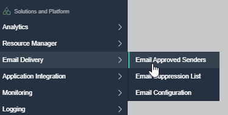
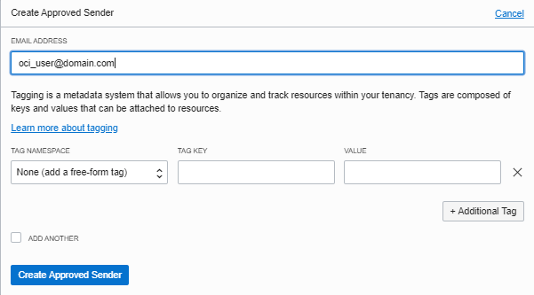
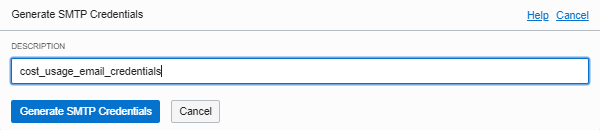
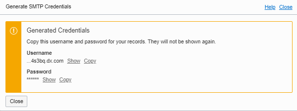

# 1. Create approved sender
```
OCI -> Menu -> Solutions and Platform -> Email Delivery -> Email Approved Sender
--> Create approved sender
--> email address to be used, your domain must allow to send e-mail from it, if not use report@oracleemaildelivery.com, 
```





# 2. Create user smtp password
```
OCI -> Menu -> Identity -> Users

Find the user that will send e-mail
Bottom left -> SMTP Credentials 

Generate SMTP Credentials
--> Description = cost_usage_email_credentials
--> Copy the username and password to notepad, they won't appear again
```






# 3. Find connection end point for current region

Find your SMTP endpoint from the documentation - 

https://docs.cloud.oracle.com/en-us/iaas/Content/Email/Tasks/configuresmtpconnection.htm

Example For Ashburn - smtp.us-ashburn-1.oraclecloud.com

# 4. Setup postfix e-mail - part #1 - main.cf

Following the documentation - https://docs.cloud.oracle.com/en-us/iaas/Content/Email/Reference/postfix.htm

```
Login to the unix machine

sudo vi /etc/postfix/main.cf

# Add the following information to the end of the file:
smtp_tls_security_level = may 
smtp_sasl_auth_enable = yes 
smtp_sasl_password_maps = hash:/etc/postfix/sasl_passwd 
smtp_sasl_security_options =

# Update the Postfix main.cf file - If the following line is present, either remove the line or turn it off:
smtpd_use_tls = yes

# Update relayhost to include your SMTP connection endpoint and port. take it from item #3
relayhost = smtp.us-ashburn-1.oraclecloud.com:587	
```

# 5. Setup postfix e-mail - part #2 - sasl_passwd

```
sudo vi /etc/postfix/sasl_passwd

# Add your relay host and port by entering:
# server:port user:pass

smtp.us-ashburn-1.oraclecloud.com:587 ocid1.user.oc1..aaaaaaa....@ocid1.tenancy.oc1..aaaaaaa.....:password

# run
sudo chown root:root /etc/postfix/sasl_passwd && sudo chmod 600 /etc/postfix/sasl_passwd
sudo postmap hash:/etc/postfix/sasl_passwd
```

# 6. Setup postfix e-mail - part #3 - Reload Postfix

```
# if postfix running - run start else reload
sudo systemctl enable postfix
sudo postfix start
sudo postfix reload
```

# 7. Setup postfix e-mail - part #4 - Test Mail

```
# Test e-mail
echo "This is a test message" | mail -s "Test" -r "report@oracleemaildelivery.com" youremail@yourdomain.com
```

# 8. Clone the OCI SDK Repo from Git Hub 

```
# Required if previous clone not includes run_daily_report.sh
cd $HOME
sudo yum install -y git
git clone https://github.com/oracle/oci-python-sdk
cd oci-python-sdk/examples/usage_reports_to_adw/shell_scripts
chmod +x run_daily_report.sh
```

# 9. Update script parameters

```
# update run_daily_report.sh for the database connection and mail info details
export DATABASE_USER=usage
export DATABASE_PASS=<password>
export DATABASE_NAME=adwcusg_low

export MAIL_FROM_NAME="Cost.Report"
export MAIL_FROM_EMAIL="report@oracleemaildelivery.com"
export MAIL_TO="oci.user@oracle.com"
```

# 10. Execute the script

```
./run_daily_report.sh
```

# 11. Add crontab to run daily at 7am

```
# add the line to the crontab using - crontab -e
0 7 * * * timeout 6h /home/opc/oci-python-sdk/examples/usage_reports_to_adw/shell_scripts > /home/opc/oci-python-sdk/examples/usage_reports_to_adw/shell_scripts/run_daily_report_crontab_run.txt 2>&1
```
