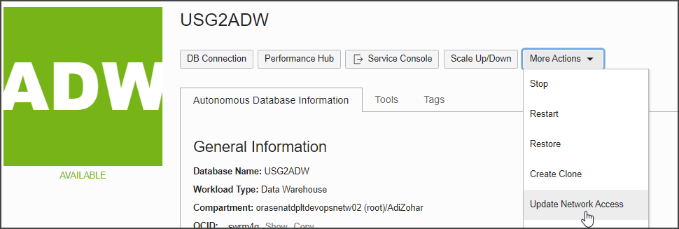
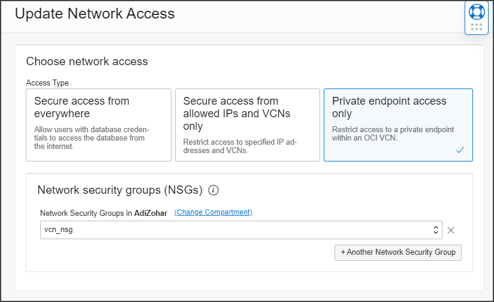
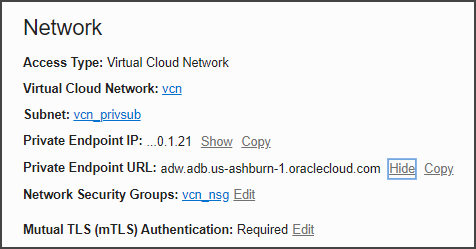
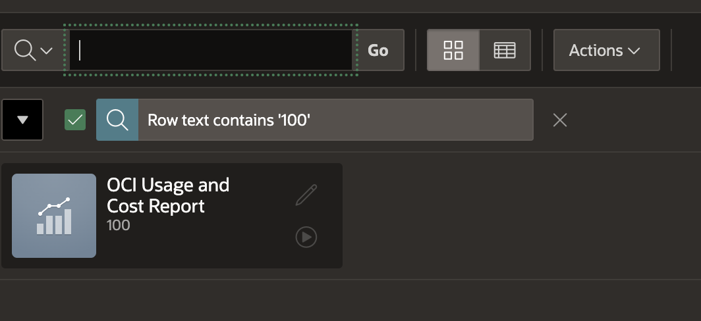
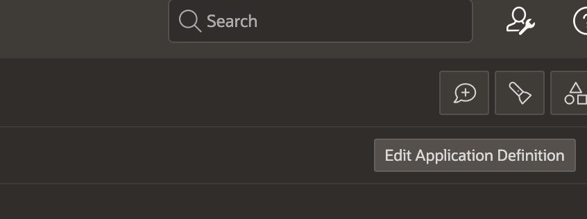
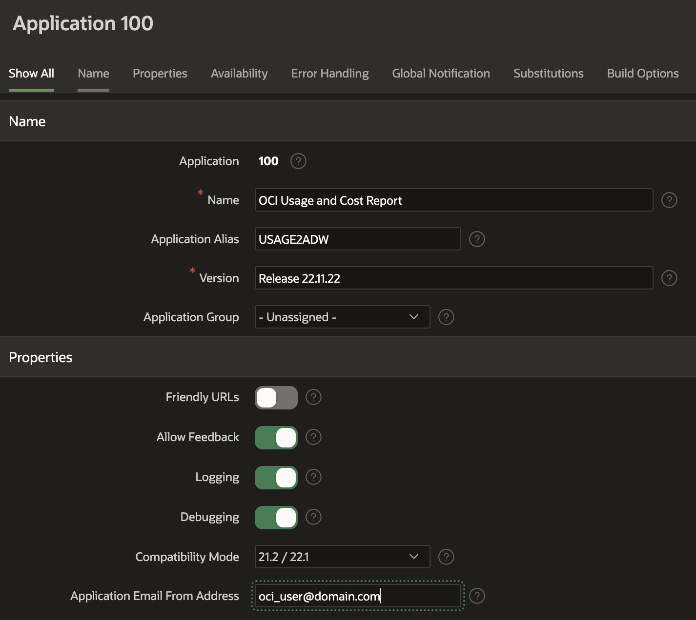
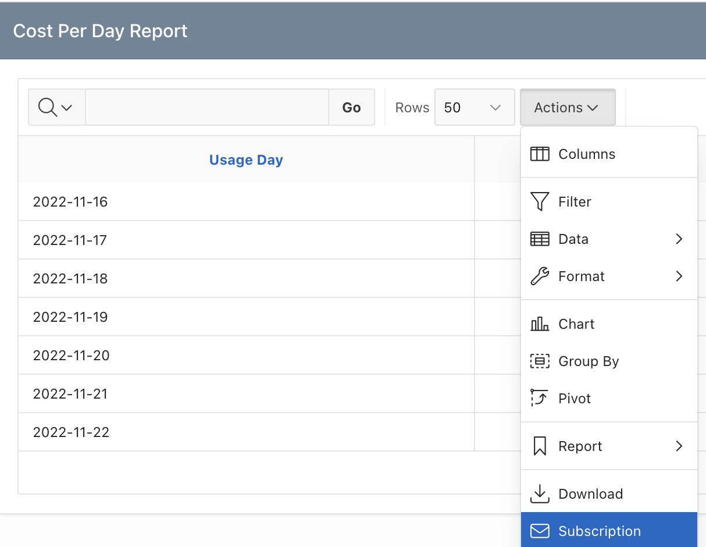

# Usage2ADW - Oracle Cloud Infrastructure Usage and Cost Reports to Autonomous Database with APEX Reporting

## How To Manual

**DISCLAIMER – This is not an official Oracle application,  It does not supported by Oracle Support, It should NOT be used for utilization calculation purposes, and rather OCI's official 
[cost analysis](https://docs.oracle.com/en-us/iaas/Content/Billing/Concepts/costanalysisoverview.htm) 
and [usage reports](https://docs.oracle.com/en-us/iaas/Content/Billing/Concepts/usagereportsoverview.htm) features should be used instead.**

**Developed by Adi Zohar, 2020-2023**

## Content
[1. How to create additional APEX End User Accounts](#1-how-to-create-additional-apex-end-user-accounts)

[2. How to change Autonomous Database to Private End Point](#2-how-to-change-autonomous-database-to-private-end-point)

[3. How to add multiple tenants](#3-how-to-add-multiple-tenants)

[4. How to upgrade the usage2adw application and APEX](#4-how-to-upgrade-the-usage2adw-application-and-apex)

[5. How to Refresh the Autonomous Database Wallet for the usage2adw application](#5-how-to-refresh-the-autonomous-database-wallet-for-the-usage2adw-application)

[6. How to upgrade Oracle Instant Client to Version 19.18](#6-how-to-upgrade-oracle-instant-client-to-version-1918)

[7. How to Schedule Daily Report](#7-how-to-schedule-daily-report)

[8. How to Setup e-mail subscription](#8-how-to-setup-e-mail-subscription)

[9. How to Enable showoci extract on usage2adw vm](#9-how-to-enable-showoci-extract-on-usage2adw-vm)

## 1. How to create additional APEX End User Accounts

```
   Login to Workspace Managament 
   Top 3rd Right Menu -> Manage Users and Groups
   --> Create User
   
   Fill:
   --> Username
   --> Email
   --> Password
   --> Confirm Password
   --> Optional - Require to change passqword = No
   --> Apply Changes
```


   

## 2. How to change Autonomous Database to Private End Point

Login to OCI Console -> Menu -> Oracle Database -> Autonomous Database

Choose The Autonomous database for Usage2ADW

More Actions Menu -> Update Network Access



#### Update Network Access

Choose Network Access -> Private endpoint access Only

Choose Network security group that will assigned to the Autonomous database

If you don't have Network Security Group, Go to the Virtual Cloud Network and Create one.

Make sure you allow port 1522/TCP inbound traffic.



#### Update VM tnsnames to the private endpoint

Find the Private Endpoint URL:



Login to the usage2adw virtual machine using ssh tool with opc user

cd ADWCUSG

Edit tnsnames.ora file and change the tnsnames *_low entry host to the private end point specify in the ADW page

## 3. How to add multiple tenants

Login to Usage2adw VM

```
   # setup oci tenant configuration
   oci setup config
   Enter a location for your config [/home/opc/.oci/config]: ( Press Enter) 
   Do you want add a profile here - Press Y
   Name of the profile - Enter the tenant name
   Complete the rest of the questions based on the user authentication

   # update run_multi_daily_usage2adw.sh
   cd /home/opc/usage_reports_to_adw/shell_scripts
   vi run_multi_daily_usage2adw.sh

   # scroll to the bottom and add lines per tenant profile, you can specify different tagspecial1 and tagspecial2 if different then the main tenant
   run_report tenant2 tagspecial1 tagspecial2
   run_report tenant3 tagspecial1 tagspecial2
```

## 4. How to upgrade the usage2adw application and APEX
```
   # on oci github:
   bash -c "$(curl -L https://raw.githubusercontent.com/oracle/oci-python-sdk/master/examples/usage_reports_to_adw/setup/setup_upgrade_usage2adw.sh)"    
```

## 5. How to Refresh the Autonomous Database Wallet for the usage2adw application

### 5a. Download Autonomus Database Wallet - If you provisioned the usaege2adw before Nov 2022:

```
   # On OCI -> MENU -> Autonomous Data Warehouse -> ADWCUSG
   --> Database Connection
   --> Wallet Type = Instance Wallet
   --> Download Client Credential
   --> Specify the Password
   --> Download the wallet to wallet.zip
   --> Copy the Wallet to the Linux folder /home/opc with the name wallet.zip
```

### 5b. Download Autonomus Database Wallet using oci cli if you provisioned the usage2adw after Nov 2022.
```
   # Download command exist in the boot.log
   ---> Login to the usage2adw vm using ssh using opc user
   ---> Check the boot.log content using below script
   ---> Command to download the wallet appears similar to the below, please adjust the admin password if you changed it
   grep autonomous-database boot.log
   oci db autonomous-database generate-wallet --autonomous-database-id ocid1.autonomousdatabase.oc1.iad.anuwclxxxxx --password yyyyyyy --file /home/opc/wallet.zip --auth instance_principal
   ---> Run the command, if any error follow the manual download section 5a above
```

### Replace existing wallet folder
```
   ---> Rename existing wallet folder to old (if old folder exist, delete it using rm -rf ADWCUSG.old )
   mv ADWCUSG ADWCUSG.old

   ---> Extract the new wallet
   unzip -o wallet.zip -d /home/opc/ADWCUSG

   ---> Fix sqlnet.ora params
   sed -i "s#?/network/admin#$HOME/ADWCUSG#" ~/ADWCUSG/sqlnet.ora

   ---> Run the script to check
   $HOME/usage_reports_to_adw/shell_scripts/run_multi_daily_usage2adw.sh
```

If you deployed usage2adw before Jan 2022 you may need to download new Oracle Instant Client - check next section

## 6. How to upgrade Oracle Instant Client to Version 19.18

```
   sudo rpm -i --force --nodeps https://download.oracle.com/otn_software/linux/instantclient/1918000/oracle-instantclient19.18-basic-19.18.0.0.0-1.x86_64.rpm
   sudo rpm -i --force --nodeps https://download.oracle.com/otn_software/linux/instantclient/1918000/oracle-instantclient19.18-sqlplus-19.18.0.0.0-1.x86_64.rpm
   sudo rpm -i --force --nodeps https://download.oracle.com/otn_software/linux/instantclient/1918000/oracle-instantclient19.18-tools-19.18.0.0.0-1.x86_64.rpm
   sudo rm -f /usr/lib/oracle/current
   sudo ln -s /usr/lib/oracle/19.18 /usr/lib/oracle/current

   # Check by running the application
   $HOME/usage_reports_to_adw/shell_scripts/run_multi_daily_usage2adw.sh
```

## 7. How to schedule daily report

### 7.1. Create approved sender
```
OCI -> Menu -> Solutions and Platform -> Email Delivery -> Email Approved Sender
--> Create approved sender
--> email address to be used, your domain must allow to send e-mail from it, if not use report@oracleemaildelivery.com, 
```


### 7.2. Create user smtp password
```
OCI -> Menu -> Identity -> Users

Find the user that will send e-mail
Bottom left -> SMTP Credentials 

Generate SMTP Credentials
--> Description = cost_usage_email_credentials
--> Copy the username and password to notepad, they won't appear again
```


### 7.3. Find connection end point for current region

Find your SMTP endpoint from the documentation - 

https://docs.cloud.oracle.com/en-us/iaas/Content/Email/Tasks/configuresmtpconnection.htm

Example For Ashburn - smtp.us-ashburn-1.oraclecloud.com

### 7.4. Setup postfix e-mail - part #1 - main.cf

Following the documentation - https://docs.cloud.oracle.com/en-us/iaas/Content/Email/Reference/postfix.htm

```
Login to the unix machine

sudo vi /etc/postfix/main.cf

# Add the following information to the end of the file:
smtp_tls_security_level = may 
smtp_sasl_auth_enable = yes 
smtp_sasl_password_maps = hash:/etc/postfix/sasl_passwd 
smtp_sasl_security_options =

# Update the Postfix main.cf file - If the following line is present, either remove the line or turn it off:
smtpd_use_tls = yes

# Update relayhost to include your SMTP connection endpoint and port. take it from item #3
relayhost = smtp.us-ashburn-1.oraclecloud.com:587	
```

### 7.5. Setup postfix e-mail - part #2 - sasl_passwd

```
sudo vi /etc/postfix/sasl_passwd

# Add your relay host and port by entering:
# server:port user:pass

smtp.us-ashburn-1.oraclecloud.com:587 ocid1.user.oc1..aaaaaaa....@ocid1.tenancy.oc1..aaaaaaa.....:password

# run
sudo chown root:root /etc/postfix/sasl_passwd && sudo chmod 600 /etc/postfix/sasl_passwd
sudo postmap hash:/etc/postfix/sasl_passwd
```

### 7.6. Setup postfix e-mail - part #3 - Reload Postfix

```
# if postfix running - run start else reload
sudo systemctl enable postfix
sudo postfix start
sudo postfix reload
```

### 7.7. Setup postfix e-mail - part #4 - Test Mail

```
# Test e-mail
echo "This is a test message" | mail -s "Test" -r "report@oracleemaildelivery.com" youremail@yourdomain.com
```

### 7.8. Clone the OCI SDK Repo from Git Hub 

```
# Required if previous clone not includes run_daily_report.sh
cd $HOME
sudo yum install -y git
git clone https://github.com/oracle/oci-python-sdk
cd oci-python-sdk/examples/usage_reports_to_adw/shell_scripts
chmod +x run_daily_report.sh
```

### 7.9. Update script parameters

```
# update run_daily_report.sh for the database connection and mail info details
export DATABASE_USER=usage
export DATABASE_PASS=<password>
export DATABASE_NAME=adwcusg_low

export MAIL_FROM_NAME="Cost.Report"
export MAIL_FROM_EMAIL="report@oracleemaildelivery.com"
export MAIL_TO="oci.user@oracle.com"
```

### 7.10. Execute the script

```
./run_daily_report.sh
```

### 7.11. Add crontab to run daily at 7am

```
# add the line to the crontab using - crontab -e
0 7 * * * timeout 6h /home/opc/oci-python-sdk/examples/usage_reports_to_adw/shell_scripts > /home/opc/oci-python-sdk/examples/usage_reports_to_adw/shell_scripts/run_daily_report_crontab_run.txt 2>&1
```

## 8. How to setup e-mail subscription

### 8.1. Create approved sender
```
OCI -> Menu -> Solutions and Platform -> Email Delivery -> Email Approved Sender
--> Create approved sender
--> email address to be used, your domain must allow to send e-mail from it, if not use report@oracleemaildelivery.com, 
```


### 8.2. Create user smtp password
```
OCI -> Menu -> Identity -> Users

Find the user that will send e-mail
Bottom left -> SMTP Credentials 

Generate SMTP Credentials
--> Description = cost_usage_email_credentials
--> Copy the username and password to notepad, they won't appear again
```


### 8.3. Find connection end point for current region

Find your SMTP endpoint from the documentation - 

https://docs.cloud.oracle.com/en-us/iaas/Content/Email/Tasks/configuresmtpconnection.htm

Example For Ashburn - smtp.us-ashburn-1.oraclecloud.com

### 8.4. Integrating Oracle Application Express with Email Delivery

Based on the documentation - https://docs.oracle.com/en-us/iaas/Content/Email/Reference/apex.htm

```
Login to the unix machine

connect to the ADW Database using sqlplus
> sqlplus admin@usage2adw_low

Execute:

BEGIN
	APEX_INSTANCE_ADMIN.SET_PARAMETER('SMTP_HOST_ADDRESS', 'smtp.region.oraclecloud.com');
	APEX_INSTANCE_ADMIN.SET_PARAMETER('SMTP_USERNAME', 'ocid1.user.oc1.username');
	APEX_INSTANCE_ADMIN.SET_PARAMETER('SMTP_PASSWORD', 'paste your password');
	COMMIT;
END;
/	

# Test
BEGIN
	APEX_MAIL.SEND(p_from => 'oci_user@domain.com',
		       p_to   => 'john@example.com',
		       p_subj => 'Email from Oracle Autonomous Database',
	               p_body => 'Sent using APEX_MAIL');
END;
/

```

### 8.5. Configure APEX application to use the approved sender

#### 8.5.1. Open Autonomous Database APEX Workspace

```
    OCI Console -> Autonomous Databases -> ADWCUSG -> Service Console
    Development Menu -> Oracle APEX
    Choose Workspace Login.

    Workspace = Usage
    User = Usage
    Password = Password you defined for the application


```


#### 8.5.2. Choose the OCI Usage and Cost Report application



#### 8.5.3. Press on Edit Application Definition - Top Right



#### 8.5.4. Update "Application Email From Address" with approved sender



### 8.6. Send report via download to e-mail or Subscription



```
    Please bear in mind:
    1. OCI e-mail delivery is limited to 2mb
    2. If Subscribed to report, please use future date filter 

```

## 9. How to enable showoci extract on usage2adw vm

### 9.1 Upgrade showoci and oci sdk packages

Run on oci vm

```
bash -c "$(curl -L https://raw.githubusercontent.com/adizohar/showoci/master/showoci_upgrade.sh)"    
```

### 9.2 Add read all-resources policy to allow showoci to extract data

Update the policy for the dynamic group of the host as below (inspect can be used instead but some information won't be exported)

```
Allow dynamic-group UsageDownloadGroup to read all-resources in tenancy
```

### 9.3 Add/Enable crontab to extract showoci every night

Edit crontab using crontab -e and add/update the below: (If exist remove the # before the command)

```
###############################################################################
# Crontab to run showoci every night
###############################################################################
0 0 * * * timeout 23h /home/opc/showoci/run_daily_report.sh > /home/opc/showoci/run_daily_report_crontab_run.txt 2>&1
```

### 9.4 Add-Update crontab to load showoci-csv to Autonomous database

Download run_load_showoci_csv_to_adw.sh if not exist

```
wget https://raw.githubusercontent.com/adizohar/usage_reports_to_adw/main/shell_scripts/run_multi_daily_usage2adw.sh -O /home/opc/usage_reports_to_adw/shell_scripts/run_multi_daily_usage2adw.sh
chmod +x /home/opc/usage_reports_to_adw/shell_scripts/run_multi_daily_usage2adw.sh 
```

Edit crontab using crontab -e and add/update the below (If exist remove the # before the command)

```
###############################################################################
# Crontab to run showoci_csv to ADB
###############################################################################
00 8 * * * timeout 2h /home/opc/usage_reports_to_adw/shell_scripts/run_load_showoci_csv_to_adw.sh > /home/opc/usage_reports_to_adw/cron/run_load_showoci_csv_to_adw.sh_run.txt 2>&1
```

### 9.5 showoci outputs

Showoci output locations:

```
/home/opc/showoci/report/local and /home/opc/showoci/report/local/csv
Autonomous tables - OCI_SHOWOCI_*
```

## License

Copyright (c) 2016, 2023, Oracle and/or its affiliates.  All rights reserved.
This software is dual-licensed to you under the Universal Permissive License (UPL) 1.0 as shown at https://oss.oracle.com/licenses/upl
or Apache License 2.0 as shown at http://www.apache.org/licenses/LICENSE-2.0. You may choose either license.
