# Usage2ADW - Oracle Cloud Infrastructure Usage and Cost Reports to Autonomous Database with APEX Reporting

## Step by Step installation using Oracle Cloud Marketplace on OCI VM and Autonomous Data Warehouse Database
usage2adw is a tool which uses the Python SDK to extract the usage reports from your tenant and load it to Oracle Autonomous Database.

Oracle Application Express (APEX) will be used for reporting.  

## Must be deployed at Home Region

**Developed by Adi Zohar, Feb 2020**

** DISCLAIMER – This is not an official Oracle application **

## 1. Deploy Usage2ADW from Oracle Cloud Makretplace
```
OCI -> Menu -> Marketplace -> Applications

Search - Usage2ADW

```


```

--> Choose Compartment
--> Launch Stack

```

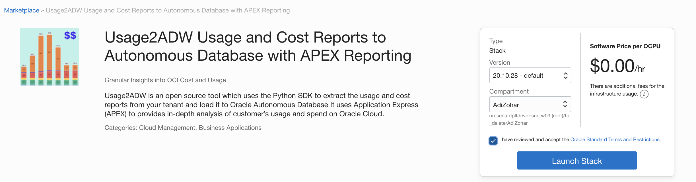

```

--> Name = Usage2ADW Usage and Cost Reports to Autonomous Database with APEX Reporting
--> Press Next 

```
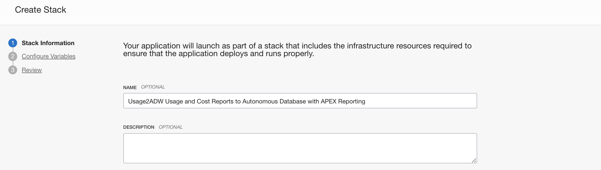


```

--> General Settings 
Stack Compartment - Specifies the Compartment where the compute node , 
Autonomous Database and Network will be built. 
It is generally the location that you have access to build the compute node and autonomous database.

```

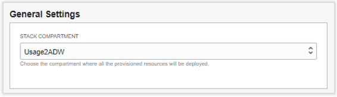

```

--> Identity Configuration - 
   - New IAM Dynamic Group and Policy will be created - 
     New Dynamic Group and Policy will be created – This option required Admin access
   - I have already created Dynamic Group and Policy per the documentation – 
     Choose this option if you already created Dynamic group and policies according to the documentation.
     Below is the requirement:
     
     Dynamic Group:
         OCI -> Menu -> Identity -> Dynamic Groups -> Create Dynamic Group
         --> Name = UsageDownloadGroup 
         --> Desc = Dynamic Group for the Usage Report Compartment
         --> Rule 1 = ANY { instance.compartment.id = 'OCID_Of_Compartment' }

     Policy:
         OCI -> Menu -> Identity -> Policies
         Choose Root Compartment
         Create Policy
         --> Name = UsageDownloadPolicy
         --> Desc = Allow Dynamic Group UsageDownloadGroup to Extract Usage report script
         Statements:
         define tenancy usage-report as ocid1.tenancy.oc1..aaaaaaaaned4fkpkisbwjlr56u7cj63lf3wffbilvqknstgtvzub7vhqkggq
         endorse dynamic-group UsageDownloadGroup to read objects in tenancy usage-report
         Allow dynamic-group UsageDownloadGroup to inspect compartments in tenancy
         Allow dynamic-group UsageDownloadGroup to inspect tenancies in tenancy
         *** Please don't change the usage report tenant OCID, it is fixed.
     
```

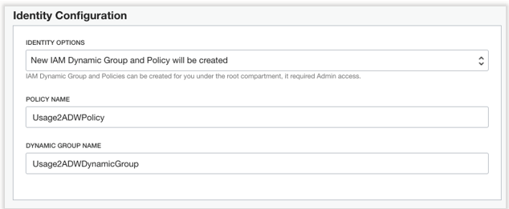

```

--> Network Configuration - 
   - New networking components will be created - Select this option to have a new network (VCN) 
     and subnet created and configured alongside this new Usaeg2ADW instance. 
     Minimal inputs are required when you select this option.
   - Existing networking components will be used - Select this option to use 
     the existing network components and subnets.

```

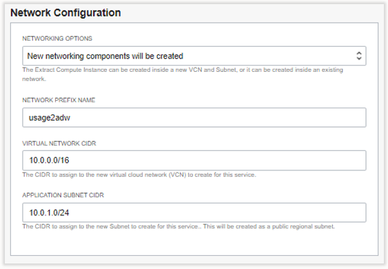

```

--> New Autonomous Database Settings - 
   - Autonomous database name – the name to be assigned to the Autonomous database
   - DB Admin Password
   - DB Wallet Password
   - DB App Password – This is the password for the application user
   - Database License – License Included or Bring your own license if you have
   - Use Free Tier – You can use the Autonomous Free tier if not used before, it will allocated 20GB of space which enough for only few months of usage
     If you choose Free Tier and the Stack failed, please edit the stack, remove the free tier and Apply it again

   * Passwords - Must be a minimum 12 characters, contain at least one uppercase letter, 
                 one lowercase letter, one number, no special characters allowed.

```

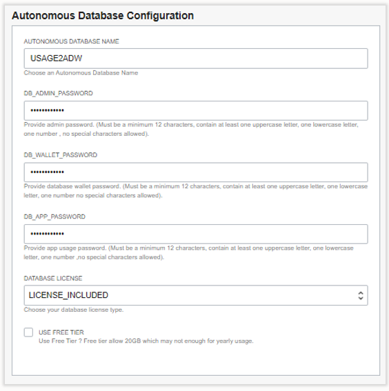

```

--> Instance Configuration - 
   - Availability Domain to deploy the instance
   - Instance Name – the name of the compute instance 
   - Compute Shape – Compute Shape to deploy the instance
     If you choose Free Tier and the Stack failed, please edit the stack, change the availability domain or remove the free tier and Apply it again
   - SSH Public Key – The public key you generated at the prerequisite stage
   - Extract Usage From Date – Load Data since which date with format of YYYY-MM (i.e. 2020-08)

```

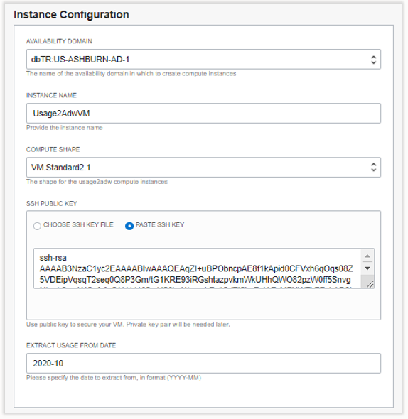


```
Click Next.
On the Review page, review the information you provided and then click Create.

When you get a message Provisioning Completed/Successful from the OCI console, the instance is created. 
However please note the rest of the Usage2ADW configuration happens in the background 
including extract of the usage which takes approximately 10 minutes to complete. 

After approximately 10 minutes log into the compute node and examine the setup.log file

```

## 3. Login to Apex Application

```
Check the Resource Manager Log and find APEX_Application_Login_URL 
Should be similar to: https://xxxxxx.adb.us-ashburn-1.oraclecloudapps.com/ords/f?p=100:LOGIN_DESKTOP::::::
Bookmark this page for future use

First time may take up to a minute to load

User = Usage
Password = Password you defined for the application

```
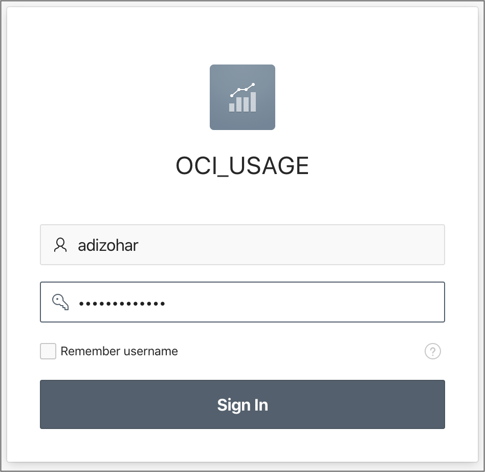

## 4. Open Autonomous Database APEX Workspace Admin if required

```
OCI Console -> Autonomous Databases -> ADWCUSG -> Service Console
Development Menu -> Oracle APEX
Choose Workspace Login.

Workspace = Usage
User = Usage
Password = Password you defined for the application


```
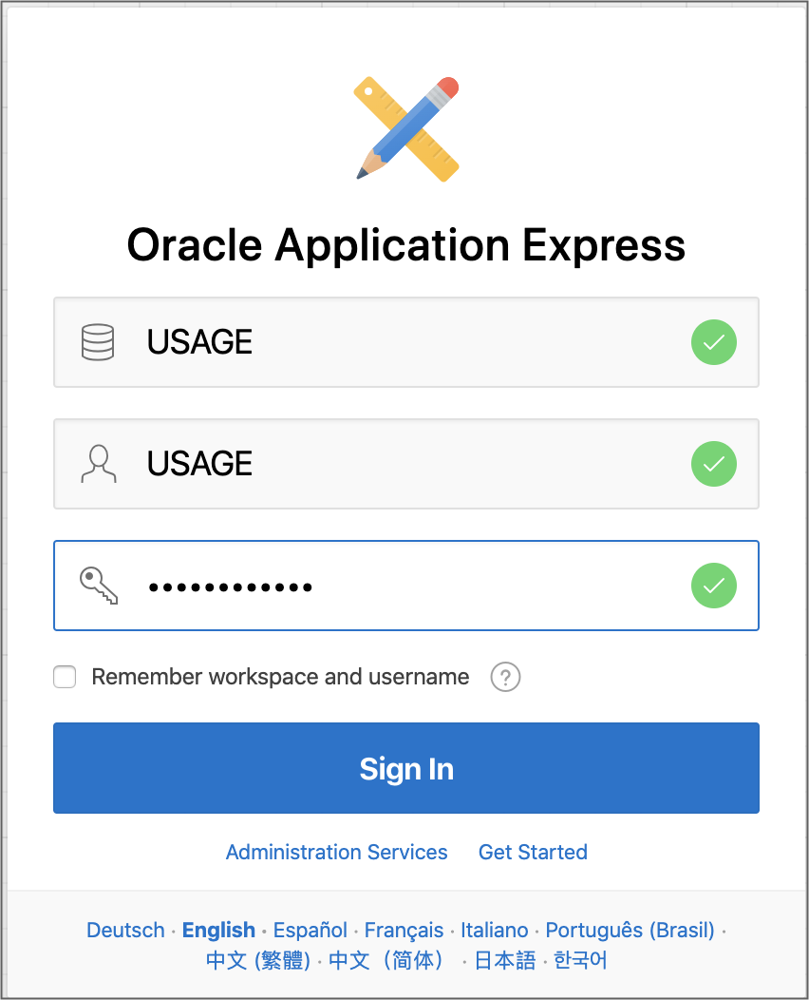


## 5. How to create additional End User Accounts

```
Login to Workspace Managament 
Top 3rd Right Menu -> Manage Users and Groups
--> Create User

Fill:
--> Username
--> Email
--> Password
--> Confirm Password
--> Optional - Require to change passqword = No
--> Apply Changes
```

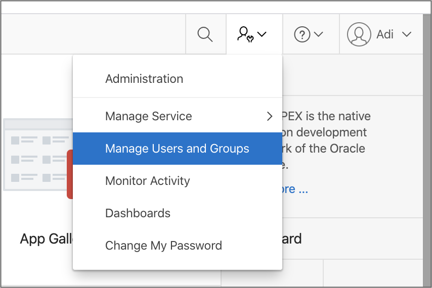

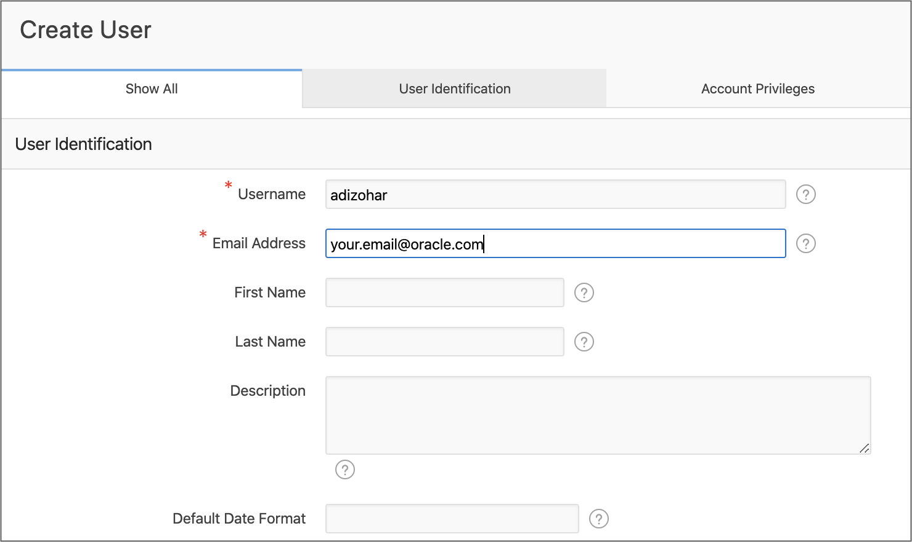

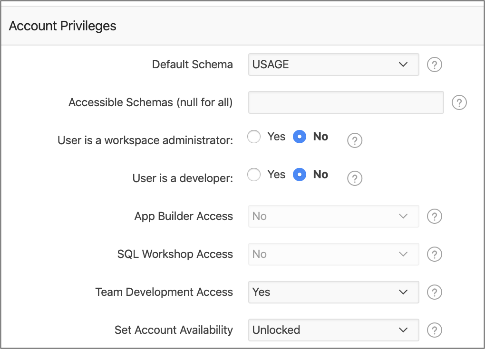

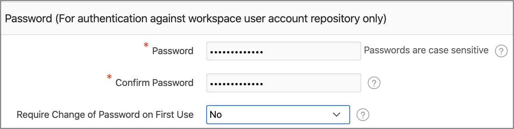
   

## 20. How to upgrade the usage2adw application and APEX
```
# on oci github:
bash -c "$(curl -L https://github.com/oracle/oci-python-sdk/blob/master/examples/usage_reports_to_adw/setup/setup_upgrade_usage2adw.sh?raw=true)"    
```


## License

Copyright (c) 2016, 2020, Oracle and/or its affiliates.  All rights reserved.
This software is dual-licensed to you under the Universal Permissive License (UPL) 1.0 as shown at https://oss.oracle.com/licenses/upl
or Apache License 2.0 as shown at http://www.apache.org/licenses/LICENSE-2.0. You may choose either license.
