# Usage2ADW - Oracle Cloud Infrastructure Usage and Cost Reports to Autonomous Database with APEX Reporting

## Step by Step Manual installation Guide on OCI VM and Autonomous Data Warehouse Database
usage2adw is a tool which uses the Python SDK to extract the usage reports from your tenant and load it to Oracle Autonomous Database.

Oracle Application Express (APEX) will be used for reporting.  

**Developed by Adi Zohar, Feb 2020**

** DISCLAIMER – This is not an official Oracle application **

## 1. Deploy VM Compute instance to run the python script
```
   OCI -> Menu -> Compute -> Instances
   Create Instance
   --> Name = UsageVM
   --> Image = Oracle Linux 7.9 or highrt
   --> Shape = VM.Standard2.1
   --> Choose your network VCN and Subnet (any type of VCN and Subnet)
   --> Assign public IP -  Optional if on public subnet
   --> Add your public SSH key
   --> Press Create
```
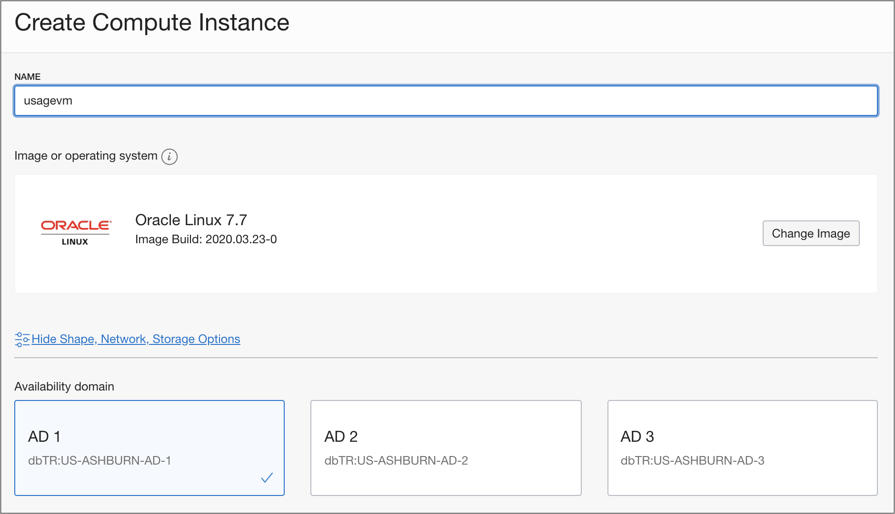

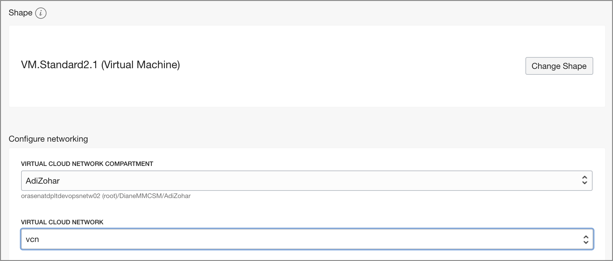

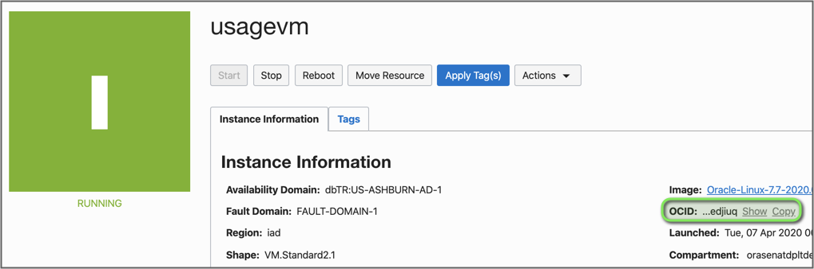

```
   Copy Instance Info:
   --> Compute OCID to be used for Dynamic Group Permission
   --> Compute IP
```

## 2. Create Dynamic Group for Instance Principles

```
   OCI -> Menu -> Identity -> Dynamic Groups -> Create Dynamic Group
   --> Name = UsageDownloadGroup 
   --> Desc = Dynamic Group for the Usage Report VM
   --> Rule 1 = ANY { instance.id = 'OCID_Of_Step_1_Instance' }
```


## 3. Create Policy to allow the Dynamic Group to extract usage report and read Compartments

```
   OCI -> Menu -> Identity -> Policies
   Choose Root Compartment
   Create Policy
   --> Name = UsageDownloadPolicy
   --> Desc = Allow Dynamic Group UsageDownloadGroup to Extract Usage report script
   --> Statement 1 = define tenancy usage-report as ocid1.tenancy.oc1..aaaaaaaaned4fkpkisbwjlr56u7cj63lf3wffbilvqknstgtvzub7vhqkggq
   --> Statement 2 = endorse dynamic-group UsageDownloadGroup to read objects in tenancy usage-report
   --> Statement 3 = Allow dynamic-group UsageDownloadGroup to inspect compartments in tenancy
   --> Statement 4 = Allow dynamic-group UsageDownloadGroup to inspect tenancies in tenancy
   *** Please don't change the usage report tenant OCID, it is fixed.
```

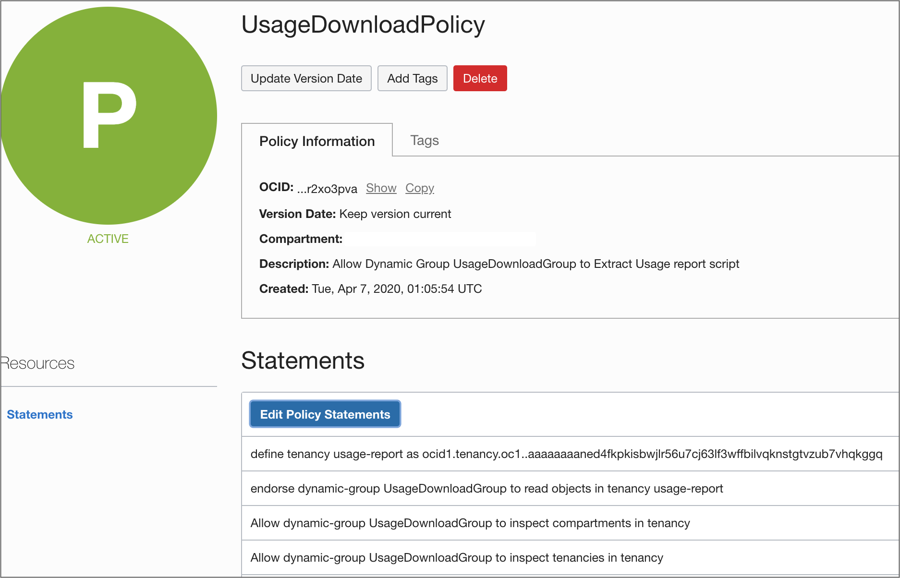

## 4. Deploy Autonomous Data Warehouse Database

```
   OCI -> Menu -> Autonomous Data Warehouse
   Create Autonomous Database
   --> Compartment = Please Choose
   --> Display Name = ADWCUSG
   --> Database Name ADWCUSG
   --> Workload = Data Warehouse
   --> Deployment = Shared
   --> Always Free = Optional
   --> OCPU = 1
   --> Storage = 1
   --> Auto Scale = No
   --> Password = (Please choose your own password)
   --> Choose Network Access = Allow secure Access from Everywhere (you can use VCN as well which requires NSG)
   --> Choose License Type
```

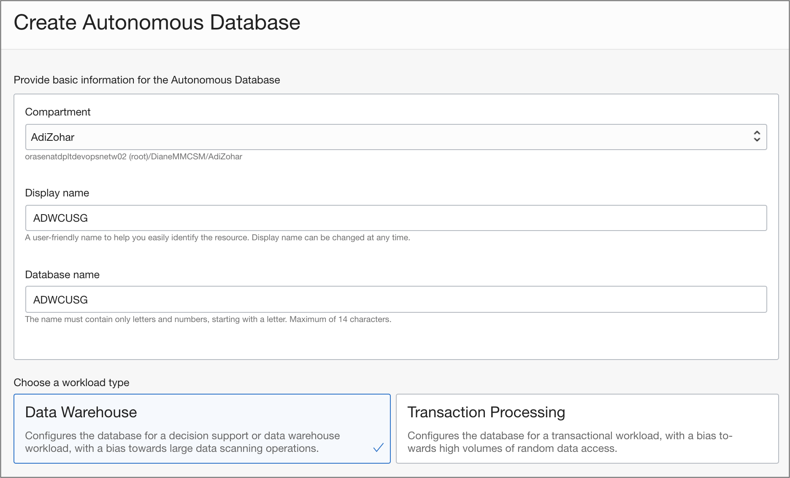

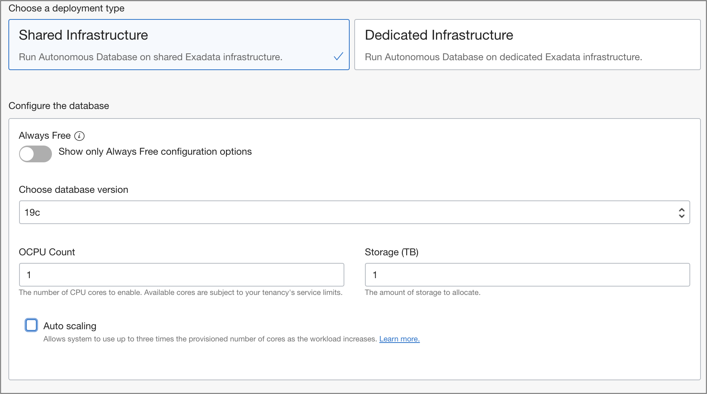

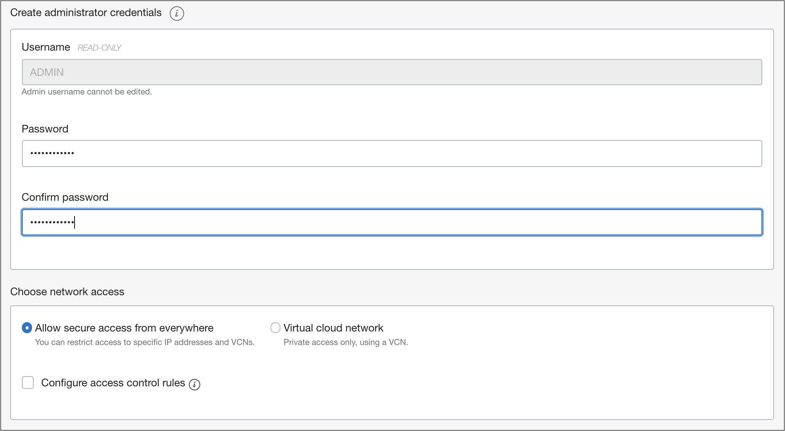

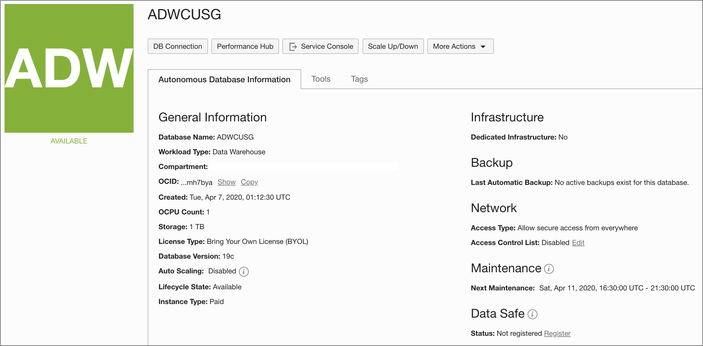

## 5. Login to Linux Machine

```
   Using the SSH key you provided, SSH to the linux machine from step #1
   ssh opc@UsageVM
```

## 6. Install Python 3 OCI packages

```
   sudo yum install -y python3
   sudo python3 -m pip install --upgrade oci oci-cli cx_Oracle requests pip

   # test instance principle is working using oci-cli
   oci os ns get --auth instance_principal
   
   [opc@usagevm ~]$ oci os ns get --auth instance_principal
   {
       "data": "orasenatdplxxxx"
   }
```

## 7. Install Oracle instant client

```
   # Please refer to the download site for Manual installation = https://www.oracle.com/database/technologies/instant-client/linux-x86-64-downloads.html

   # please choose basic and sqlplus package, below example on 19.9
   sudo rpm -i https://yum.oracle.com/repo/OracleLinux/OL7/oracle/instantclient/x86_64/getPackage/oracle-instantclient19.9-basic-19.9.0.0.0-1.x86_64.rpm
   sudo rpm -i https://yum.oracle.com/repo/OracleLinux/OL7/oracle/instantclient/x86_64/getPackage/oracle-instantclient19.9-sqlplus-19.9.0.0.0-1.x86_64.rpm
   sudo ln -s /usr/lib/oracle/19.9 /usr/lib/oracle/current

   # setup oracle home variables
   # Add the below to $HOME/.bashrc:
   export CLIENT_HOME=/usr/lib/oracle/current/client64
   export LD_LIBRARY_PATH=$CLIENT_HOME/lib
   export PATH=$PATH:$CLIENT_HOME/bin
   export TNS_ADMIN=$HOME/ADWCUSG

   # set the variables
   source $HOME/.bashrc
```
   
## 8. Download Autonomous database Wallet

```
   # on Linux -> create folder $HOME/ADWCUSG
   mkdir $HOME/ADWCUSG

   # On OCI -> MENU -> Autonomous Data Warehouse -> ADWCUSG
   --> Service Console
   --> Administration
   --> Download Client Credential
   --> Specify the Admin Password
   --> Copy the Wallet wallet_ADWCUSG.zip to the Linux folder $HOME/ADWCUSG
```

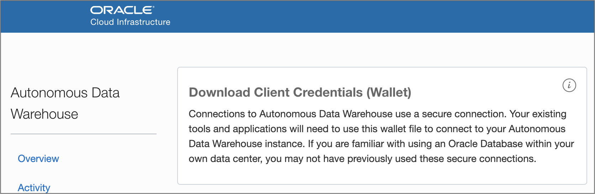

```
   # on Linux -> Unzip Wallet
   cd $HOME/ADWCUSG
   unzip wallet_ADWCUSG.zip
   
   # Change directory of sqlnet.ora to $HOME/ADWCUSG
   sed -i "s#?/network/admin#$HOME/ADWCUSG#" sqlnet.ora
```

## 9. Create Database User for the Usage repository

```
   sqlplus admin/<password>@adwcusg_low
   
   # Choose your own password
   SQL> create user usage identified by <password>;
   SQL> grant connect, resource, dwrole, unlimited tablespace to usage;
   SQL> exit
```

## 10. Clone the OCI SDK Repo from Git Hub

```
   cd $HOME
   sudo yum install -y git
   git clone https://github.com/oracle/oci-python-sdk
   ln -s oci-python-sdk/examples/usage_reports_to_adw .
   cd usage_reports_to_adw
```

## 11. Setup Credentials

This script will ask for Database Name, Admin Password, Application Password and Extract Start Date

```
   /home/opc/usage_reports_to_adw/setup/setup_credentials.sh
```

## 12. Execute the python script - usage2adw.py

```
    # Please amend the password for the USAGE schema
    python3 usage2adw.py -ip -du USAGE -dp <password> -dn adwcusg_low
```


## 13. Open Autonomous Database APEX Application

```
    OCI Console -> Autonomous Databases -> ADWCUSG -> Service Console
    Development Menu -> Oracle APEX
```

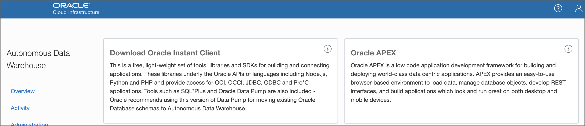

```
    Enter Admin Password - for first time setup
```

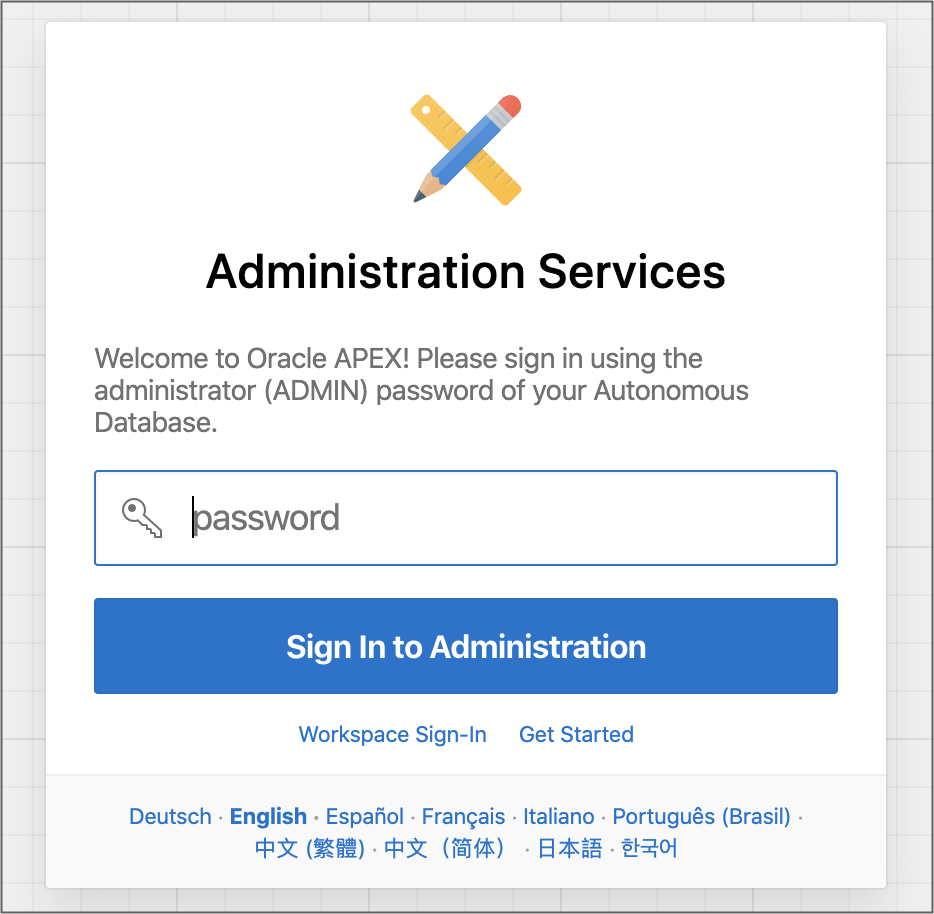


## 14. Create APEX workspace

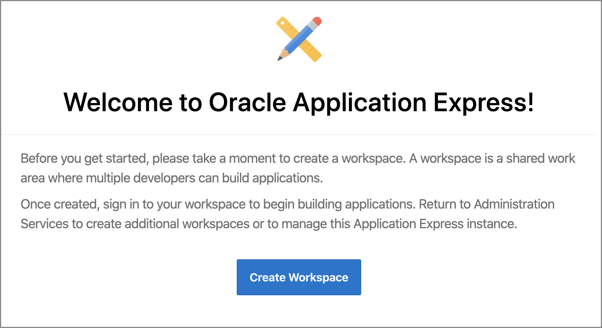

```
    Database User = USAGE
    Workspace Name = USAGE
```

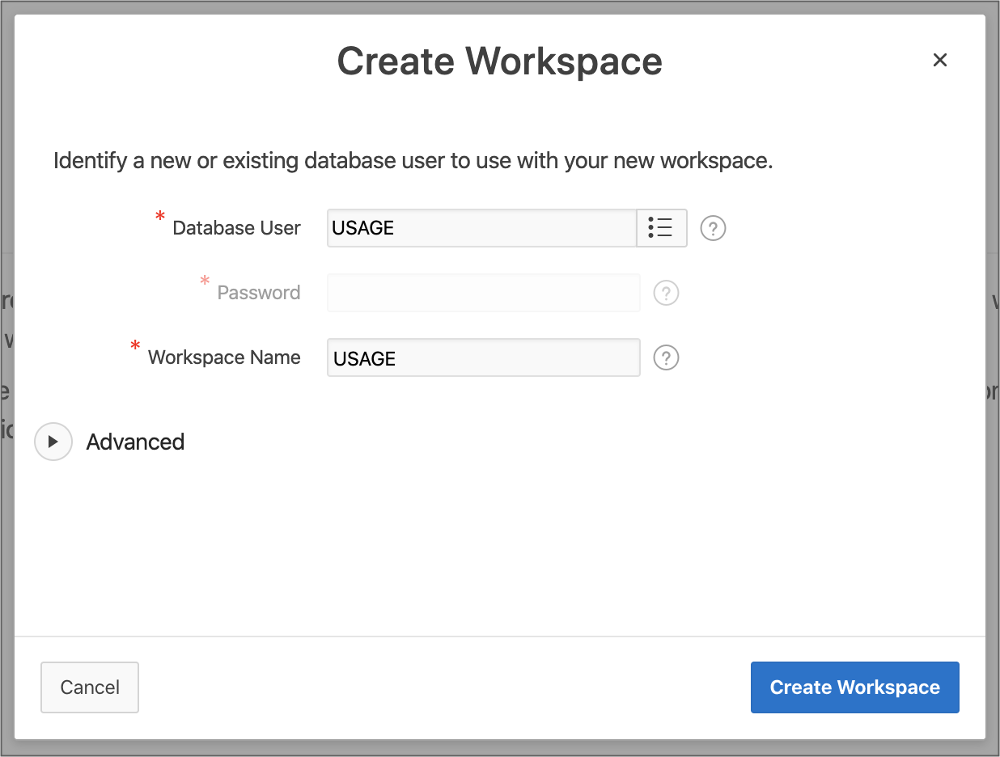

```
    Sign Out - Top Right Menu -> Sign Out
```

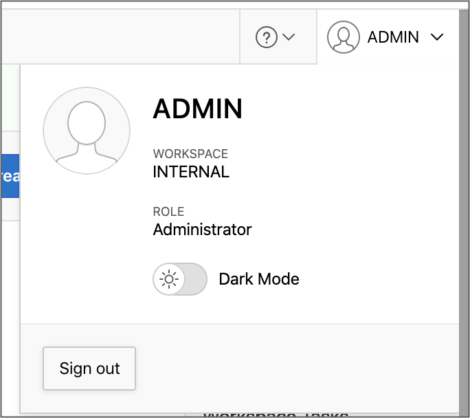

## 15. Setup APEX Administrator User Application

```
   Login under USAGE Workspace
   --> Workspace = USAGE
   --> Username = USAGE
   --> Password = "USAGE Schema Password"
   --> Press Continue
 
   Specify your e-mail and name.
   --> Apply Changes
```


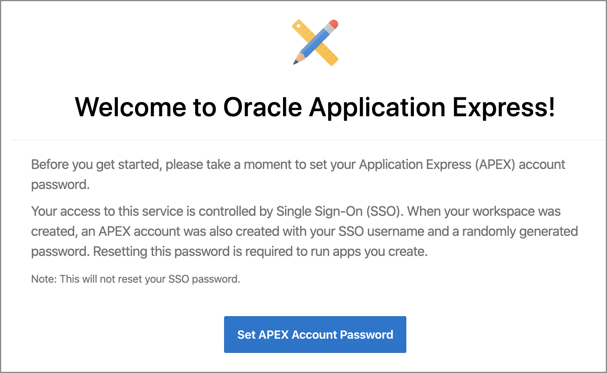

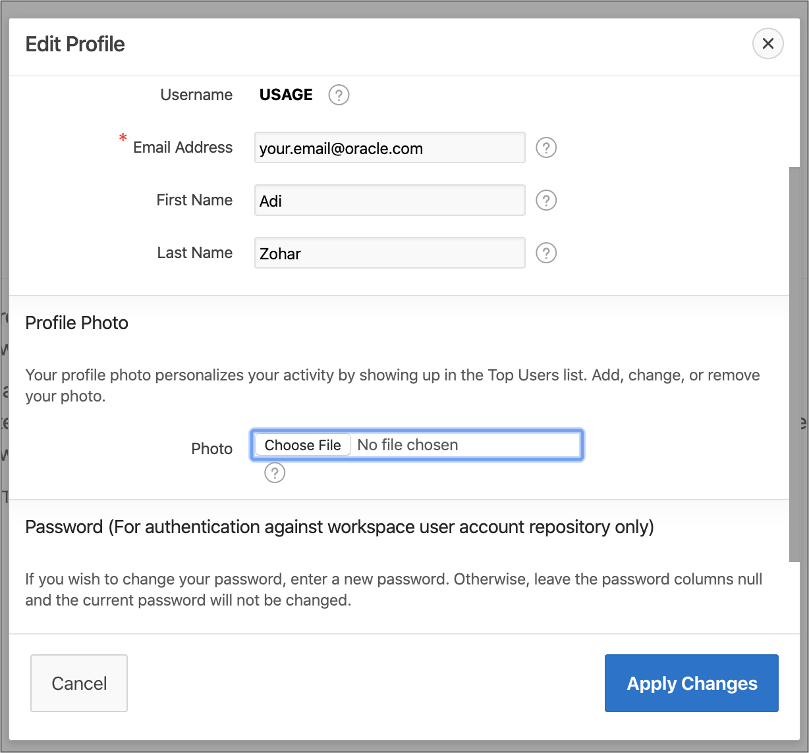

## 16. Create End User Account

```
   Top 3rd Right Menu -> Manage Users and Groups
   --> Create User
   
   Fill:
   --> Username
   --> Email
   --> Password
   --> Confirm Password
   --> Optional - Require to change passqword = No
   --> Apply Changes
```


   
## 17. Import APEX application

Right Click and Download [usage.demo.apex.sql](https://raw.githubusercontent.com/oracle/oci-python-sdk/master/examples/usage_reports_to_adw/apex_demo_app/usage.demo.apex.sql) from github "apex_demo_app" folder (raw)

```
   APEX Top Menu -> App Builder -> Import
   --> Choose File = usage.demo.apex.sql (Download from github apex folder)
   --> Press Next
   --> Press Next 
   --> Press Install Application
   --> Press Next 
   --> Press Install 
```

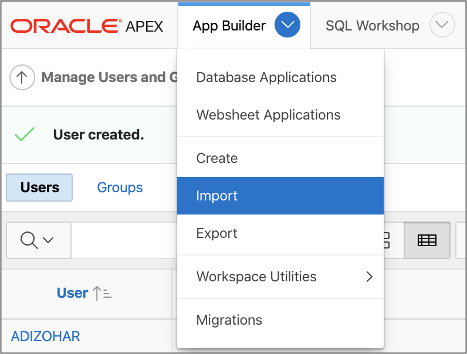

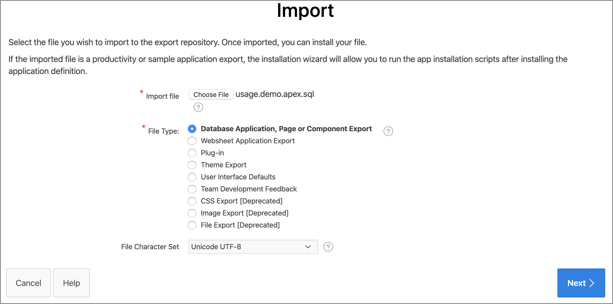

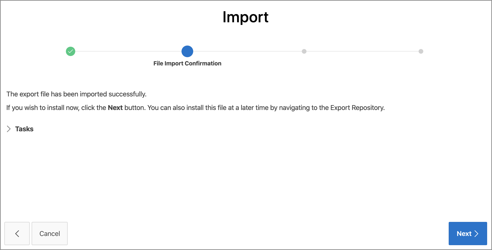

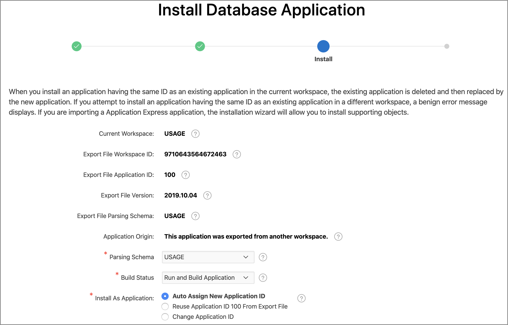

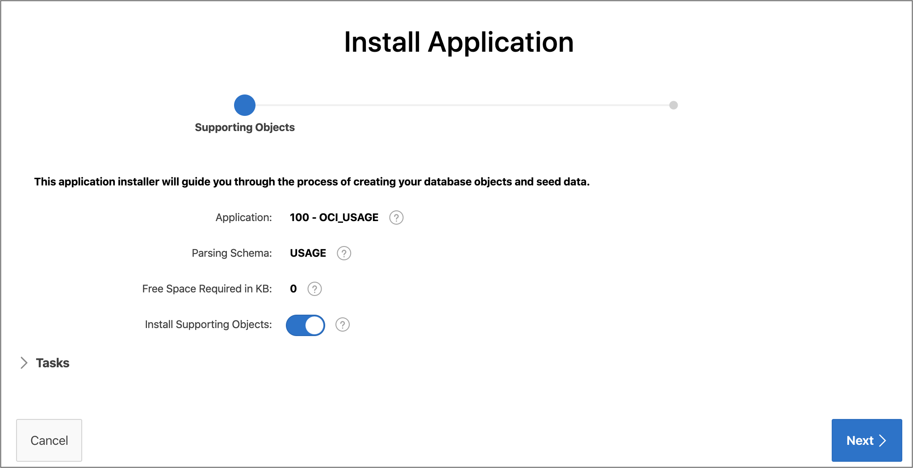

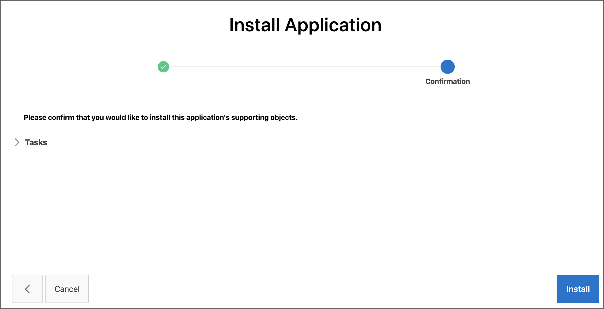

## 18. Execute Application

```
    Press Run application
    Bookmark the page for future use.
    Login = your end user username and password
```


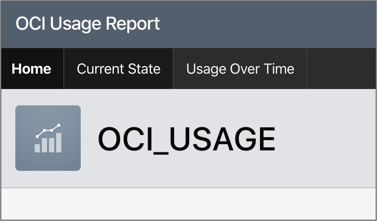

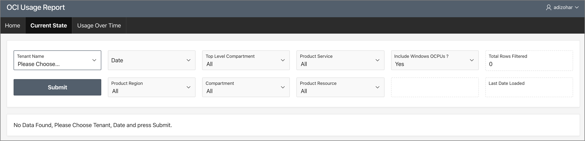


## 19. Schedule a crontab job to execute the load daily
```
    # Amend the oracle instance client path run_daily_usage2adw.sh according to your environment. i.e. 18.3 or later
    $HOME/usage_reports_to_adw/shell_scripts/run_single_daily_usage2adw.sh

	# change execution permission
	chmod +x $HOME/usage_reports_to_adw/shell_scripts/run_single_daily_usage2adw.sh
 
	# Test the execution
	$HOME/usage_reports_to_adw/shell_scripts/run_single_daily_usage2adw.sh
   
    # add crontab that execute every night
    0 0 * * * timeout 6h /home/opc/usage_reports_to_adw/shell_scripts/run_single_daily_usage2adw.sh > /home/opc/usage_reports_to_adw/shell_scripts/run_single_daily_usage2adw_crontab_run.txt 2>&1
```

## 20. How to upgrade the usage2adw software and "OCI Usage and Cost Report" APEX application
```
    # clone the software from github:
    cd $HOME
    git clone https://github.com/oracle/oci-python-sdk

    # Execute the python script in order to upgrade the metadata
    cd oci-python-sdk/examples/usage_reports_to_adw
    python3 usage2adw.py -ip -du USAGE -dp <password> -dn adwcusg_low
    
    # Login to APEX workspace and choose "OCI Usage and Cost Report" Application
    On the right menu -> Delete this application
    
    # Import the new APEX Application
    Follow section 17 - Import APEX application
```

## License

Copyright (c) 2016, 2020, Oracle and/or its affiliates.  All rights reserved.
This software is dual-licensed to you under the Universal Permissive License (UPL) 1.0 as shown at https://oss.oracle.com/licenses/upl
or Apache License 2.0 as shown at http://www.apache.org/licenses/LICENSE-2.0. You may choose either license.
